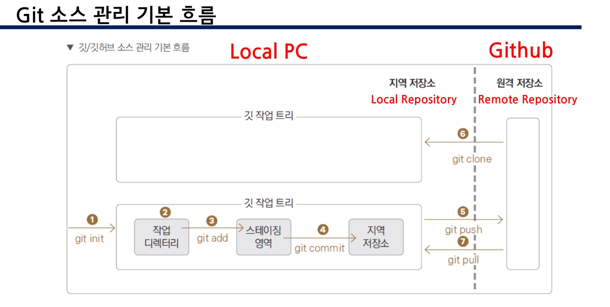

# git

## Git 활용하여 소프트웨어 관리하기

---

### 프로젝트 시작

모든 프로젝트는 username과 useremail을 입력된 상태에서 commit을 진행할 수 있음

```python
git config --global username "hayeonjung0"
git config --global useremail "chung210109@dongyang.ac.kr"
```

### git repository 생성

- git에서 소프트웨어의 소스코드를 저장하는 단위
- 보통 소프트웨어 제품 단위로 repository를 생성함

**새로운 프로젝트 : Local 폴더의 내용을 업로드 하는 경우(remote가 비어있어야됨 redme파일x)**

```python
git init
git remote add origin url
git add .
git commit -m 'upload'
git push origin main
```

**새로운 프로젝트 : 이미 존재하는 Remote Repository에서 Local에 동기화**

```python
git clone url
cd 폴더명
```

**기존 프로젝트 활용 시(이미 다운받은 폴더에서 시작)**

```python
git pull origin main or git fetch->git merge origin/main

```

- 버전관리
    - 사용자에게 이미 출시된 제품에 대한 관리 → Git의 태그기능을 사용해 관리
    
    ```jsx
    git tag -a v1.0.0 -m "Release v1.0.0"
    ```
    
    - 통합 관정에서 발생하는 변경 사항에 대한 관리 → Git branch 기능을 활용
- git을 이용한 소프트웨어 버전 관리 **overview**
    
    생성 → repository 동기화 → 사용자가 코드 변경 → local repository에 반영 → local에서 remote로 동기화(이후 2번부터 다시 반복)
    
- Git Repository와 Directory의 관계

### 프로젝트 개발

새로운 내용 작성(또는 기존코드 수정) 및 github 반영

```python
git add .
git commit -m 'message'
git push origin branch명
```

개발 중 다른 개발자가 github에 새로운 소스코드를 추가한 경우 해당 내역을 받아오고 싶을 때

```python
git pull origin branch명
```

## 브랜치의 개념

---

브랜치 : 개발 공간을 의미

- main branch : 완성 상태의 소스코드를 보관하는 공간
- 개발용 branch : 개발 중인 소스코드를 보관하는 공간

🔹 2020.10월을 기점으로 main이라는 이름으로 대표 저장소가 생성됨

→ 이전에는 master 사용

→ git branch -m main으로 변경 후 사용해야됨

### 브랜치를 사용해야하는 상황

- 새로운 기능을 추가
- 버그 수정
- 병합과 리베이스 테스트
- 이전 코드 개선

git에서 branch는 특정 commit을 가리키는 단순한 포인터 역할

생성 : git branch 브랜치명

이동 : git switch 브랜치명 또는 git checkout 브랜치명

삭제 : git branch -d 브랜치명(브랜치의 개발 항목이 main branch에 반영되기 전 삭제 불가)

강제삭제 : git branch -D 브랜치명

Remote Repository의 브랜치 삭제 : git push origin -d 브랜치명

(브랜치의 개발 항목이 main branch에 반영되기 전 삭제 가능)

## 프로젝트 공유

---

- 개발자 간 프로젝트 공유하여 협업하기 위해 Collaborators 설정이 필요
- Remote Repository → Settings → Collaborators → Add peple → 이메일 주소 추가

