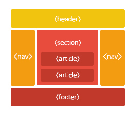

# 03 시맨틱 태그와 입력양식 form

## HTML 시맨틱웹

---

시맨틱 웹은 W3C에서 설정한 표준을 통해 웹을 확장한 것이다.

시맨틱 요소들은 브라우저에게 요소의 의미나 목적을 명확하게 알려주는 요소이다.

| 태그        | 설명                               |
| ----------- | ---------------------------------- |
| `<header>`  | 문서의 머리말                      |
| `<nav>`     | 내비게이션 링크                    |
| `<article>` | 문서의 내용이나 블로그의 포스트    |
| `<section>` | 문서의 섹션                        |
| `<aside>`   | 사이드바와 같이 옆에 위치하는 내용 |
| `<footer>`  | 문서의 꼬리말                      |



## iframe 태그

---

```jsx
<iframe src="삽입할 문서의 url" name="이름"></iframe>
```

`<iframe>`은 다른 HTML페이지를 현재 페이지에 포함 시키는 중첩된 브라우저를 의미한다.

inline 성격을 가지고 있다.

→ 요즘엔 `<span>`이나 `<div>`를 주로 이용함.

🔹 링크(a태그)의 타겟 속성은 iframe에서 지정된 name을 참조해야 한다.

```jsx
<iframe src="inner.html" name="iframe1"></iframe>
<a href="www.naver.com" targer="iframe1">네이버</a>
```

**속성**

src : 삽입할 문서의 url

width, height : 프레임의 너비와 높이

name : 요소의 이름을 명시

## div 태그로 구역 나누기

---

html 요소들은 `<div>`와 `<span>`을 이용하여 묶을 수 있다.

`<div>` 요소는 **블록형태의 요소**로서 html 요소들을 묶는 컨테이너로 사용할 수 있다. **하나의 줄을 전부 차지**한다.

`<span>` 요소는 **인라인 요소**로서 텍스트를 위한 컨테이너로 사용할 수 있다. **콘텐츠의 크기만을 차지**한다.

## HTML 입력 양식 form

---

`<form>` 태그는 html 양식을 생성하는 데 사용된다.

화면에 나타나지는 않으며, 입력 요소들을 담는 컨테이너 역할을 한다.

### 입력 요소

| `<input>`                     | type 속성에 따라 입력의 형태가 달라진다. | form 태그 밖에서 사용 가능하나 권장하지 않음                      |
| ----------------------------- | ---------------------------------------- | ----------------------------------------------------------------- |
| `<lable>`                     | 입력 요소에 대한 레이블 정의             |                                                                   |
| `<select>`                    | 리스트 정의(콤보 버튼)                   | size, multiple(다중 선택), selected(초기값)                       |
| `<option>`                    | 리스트에 선택될 수 있는 항목 정의        | value 속성을 반드시 가지고 있어야 함. → 서버로 제출되는 값을 명시 |
| selected : 특정항목 초기 선택 |
| `<optgroup>`                  | 그룹핑                                   |                                                                   |
| `<textarea>`                  | 다중 입력 창                             | name, rows(세로, 줄), cols(가로, 너비)                            |

공간이 초과되는 경우 자동으로 스크롤바가 생성됨.
주로 이용약관에 사용됨 |
| `<button>` | 설정 값이 없는 클릭 가능한 버튼 생성 | |
| `<fieldset>` | 데이터 그룹핑할 때 사용 | legend : 그룹 제목 설정 |
| `<datalist>` | 미리 정의된 옵션 목록 지정 | |

type : 입력 요소의 유형이다.

value : 입력 요소의 초기값이다.

name : 요소의 이름을 명시한다.

name 속성은 폼(form)이 제출된 후 서버에서 폼 데이터(form data)를 참조하기 위해 사용되거나, 자바스크립트에서 요소를 참조하기 위해 사용된다.

<aside>
💡

value 속성은 <input> 요소의 type 속성값에 따라 다른 용도로 사용됩니다.

- “button”, “reset”, “submit” : 버튼 내의 텍스트를 정의함.
- “text”, “password” : 입력 필드의 초깃값을 정의함.
- “checkbox”, “image”, “radio” : 해당 입력 필드를 선택 시 서버로 제출되는 값을 정의함.

또한, <input> 요소의 type 속성값이 “file”인 경우에는 value 속성을 사용할 수 없음.

</aside>

```python
<form>
     아이디 : <input type="text" size="15"><br>
     비밀번호 : <input type="password" size="15"><br>
     이메일 : <input type="email" name="email"><br>
     색상 : <input type="color" name="color"><br>
     숫자 : <input type="number" name="number" min="1" max="10" step="2"><br>
     범위 : <input type="range" min="1" max="10" step="2"><br>
     월 : <input type="month"><br>
     날짜 : <input type="date"><br>
     <input type="submit" value="제출">
     <input type="reset" value="취소">
  </form>
```

**속성값**

| text                          | 텍스트 창                                          | name, size                              |
| ----------------------------- | -------------------------------------------------- | --------------------------------------- |
| password                      | 비밀번호 창(\*로 표시됨)                           |                                         |
| radio                         | 라디오 버튼 생성(동그라미 선택 창, 다중 선택 불가) | name, value                             |
| checkbox                      | 체크 박스 생성(사각형, 다중선택 가능)              | name, value, checked(다중 선택)         |
| file                          | 파일 이름 입력 필드 생성                           |                                         |
| reset                         | 초기화 버튼 생성                                   |                                         |
| submit                        | 제출 버튼 생성                                     | action(속성에 지정된 스크립트로 보내짐) |
| image                         | 이미지를 전송 버튼으로 만듦                        |                                         |
| button                        |                                                    | onclick : 버튼이 클릭되면               |
| alert() : 경고 대화 상자 표시 |

추가된 `<input>`type

| date   | 날짜를 입력할 수 있는 컨트롤                            |
| ------ | ------------------------------------------------------- |
| color  | 색상 코드를 입력할 수 있는 컨트롤                       |
| email  | 표준 이메일 주소를 입력받아서 검증하는 컨트롤           |
| range  | 2개의 숫자 사이의 숫자를 선택할 수 있는 슬라이더 컨트롤 |
| number | 숫자만 입력받는 컨트롤                                  |

`<input>` 속성

| autocomplete                    | 자동완성                                                |
| ------------------------------- | ------------------------------------------------------- |
| autofocus                       | 입력 대기상태 (커서 깜빡임)                             |
| placeholder                     | 입력 힌트 제공(글씨로 인식되지 않음)                    |
| value는 보여지면 글씨로 인식됨. |
| readonly                        | 읽기 전용                                               |
| required                        | 제출하기 전 반드시 채워져 있어야 함을 나타냄(필수 입력) |
