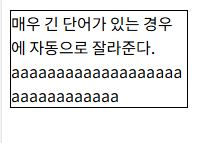
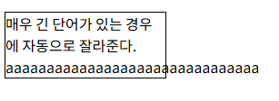

# 04 CSS 선택자, 텍스트

## CSS 모듈

---

- 선택자
- 배경 및 경계선
- 텍스트 효과
- 다중 컬럼 레이아웃
- 박스 모델
- 2차원 및 3차원 변환
- 애니메이션
- 사용자 인터페이스

## CSS 문법

---

```jsx
선택자(selector) { 속성(property): 값(value); }
```

## 선택자

---

선택자란 HTML 요소를 선택하는 부분이다.

- 타입 선택자
  HTML 요소 이름을 사용
  ```jsx
  h1 {color: red;}
  ```
- 아이디 선택자
  특정 요소 선택, id를 부여해야 되며, 고유의 값이다.
  ```jsx
  <!--id 부여-->
  <p id="special"> HTML 학습하기 </p>

  /*#으로 선택*/
  #special{color: red;}
  ```
- 클래스 선택자
  여러 요소들을 하나의 클래스로 묶어서 선택 가능, class 이름을 부여해야됨, .으로 선택
  ```jsx
  <!--class 이름 부여-->
  <p class="type1">HTML 학습하기</p>
  <p class="type1">CSS 학습하기</p>

  /* . 으로 선택 */
  .type1{color: red;}
  ```
- 전체 선택자
  \*기호로 표시되며 페이지 안의 모든 요소를 선택
  ```jsx
  *{color: red
  ```
- 속성 선택자
- 의사 선택자
  콜론(:)을 사용해 표기, 클래스를 정의하지 않아도 정의된 것처럼 간주한다는 의미이다.
  | 의사 클래스    | 설명                                 |
  | -------------- | ------------------------------------ |
  | ::before       | 요소의 시작 부분에 콘텐츠 추가       |
  | ::after        | 요소의 끝 부분에 콘텐츠를 추가       |
  | ::first-child  | 현재 요소의 첫 번째 자식 요소를 선택 |
  | ::first-letter | 요소의 첫 글자에 스타일을 정의       |
  | : link         | 아직 방문되지 않은 하이퍼링크        |
  | :visited       | 방문된 하이퍼링크                    |
  | :hover         | 요소 위에 마우스가 있는 상태         |
  | :nth-child()   | 요소의 n번째 자식을 선택             |

### 선택자 그룹

선택자를 ,(콤마)로 분리하여 나열

```jsx
h1, h2, h3{color: red;}
```

### 자손, 자식 선택자

| 선택자  | 설명                                           |
| ------- | ---------------------------------------------- |
| s1 s2   | s1 요소의 후손인 s2요소를 선택(후손관계)       |
| s1 > s2 | s1 요소의 직계 자식 요소인 s2를 선택(자식 관계 |

## CSS를 추가하는 방법

---

1. 내부 스타일 시트(internal style sheet)

<head> 요소 안에 넣는 방법

2. 외부 스타일 시트(external style sheet)

   css 파일을 외부에 저장하는 방법

   .css라는 확장자를 가져야 한다.

3. 인라인 스타일 시트(inline style sheet)

   각각의 요소마다 스타일을 지정하는 방법

### 우선순위

인라인 스타일 > 내부 스타일 > 외부 스타일 > 웹 브라우저 디폴트 값

## 폰트

---

| font        | 한 줄에서 모든 폰트 속성 지정              |
| ----------- | ------------------------------------------ |
| font-family | 폰트 패밀리 설정(종류)                     |
| font-size   | 폰트 크기 설정(px, %, em)                  |
| font-style  | 폰트 스타일 설정( normal, italic, oblique) |
| font-weight | 폰트 볼드체 여부 설정(normal, bold)        |

### 폰트의 종류

```jsx
font-family: "1순위", "2순위", "3순위(일반적인 폰트를 지정해야됨)"
```

### 폰트 크기

1. px단위
2. % 단위
3. em 단위

   W3C에서 권장하는 단위로 배수를 의미함

4. 키워드

   xx-small, x-small, medium, large, x-large, xx-large

## 텍스트 스타일

---

| color           | 텍스트의 색상                  |                                     |
| --------------- | ------------------------------ | ----------------------------------- |
| direction       | 텍스트의 작성 방향(가로, 세로) |                                     |
| letter-spacing  | 글자 간 간격(자간)             |                                     |
| line-height     | 텍스트 줄의 높이(행간)         |                                     |
| text-align      | 수평 정렬을 지정               | center, right, left, justify        |
| text-decoration | 텍스트의 장식을 지정           | overline, line-through, underline   |
| text-indent     | 들여쓰기를 지정                |                                     |
| text-shadow     | 그림자 효과                    | x방향, y방향, 흐림정도, 그림자 색상 |
| text-transform  | 대소문자 변환                  | uppercase, lowercase, capitalize    |
| word-wrap       | 박스 영역을 넘칠 때 줄바꿈     | break-word                          |
| column          | 컬럼 분리                      | count, gap, rule                    |

### word-wrap

단어가 너무 길어서 영역을 벗어날 때 자동으로 단어를 잘라 다음줄로 넘기는 기능

```jsx
<style>
	p.test {
  width: 11em;
  border: 1px solid #000000;
  word-wrap: break-word;
  }
</style>
```

```jsx
<body>
  <p class="test">
    매우 긴 단어가 있는 경우에 자동으로 잘라준다.
    aaaaaaaaaaaaaaaaaaaaaaaaaaaaaaa
  </p>
</body>
```





### 다중 컬럼

```jsx
<style>
   .poet{
       column-count: 3; /*분할해야 하는 컬럼의 수*/
       column-gap: 20px; /*컬럼 사이의 간격*/
       column-rule: 4px double #ff00ff; /*선두께, 스타일, 색상*/
        }
</style>
```
