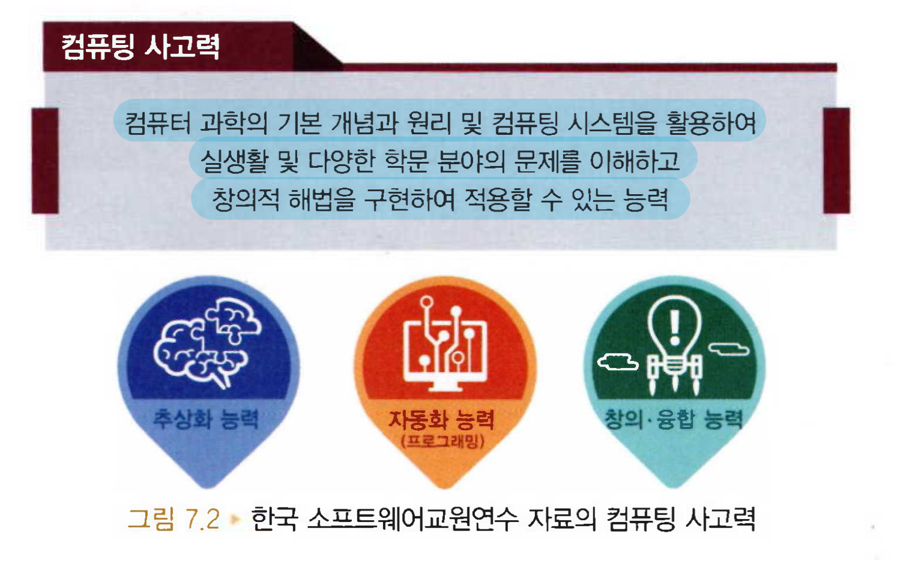
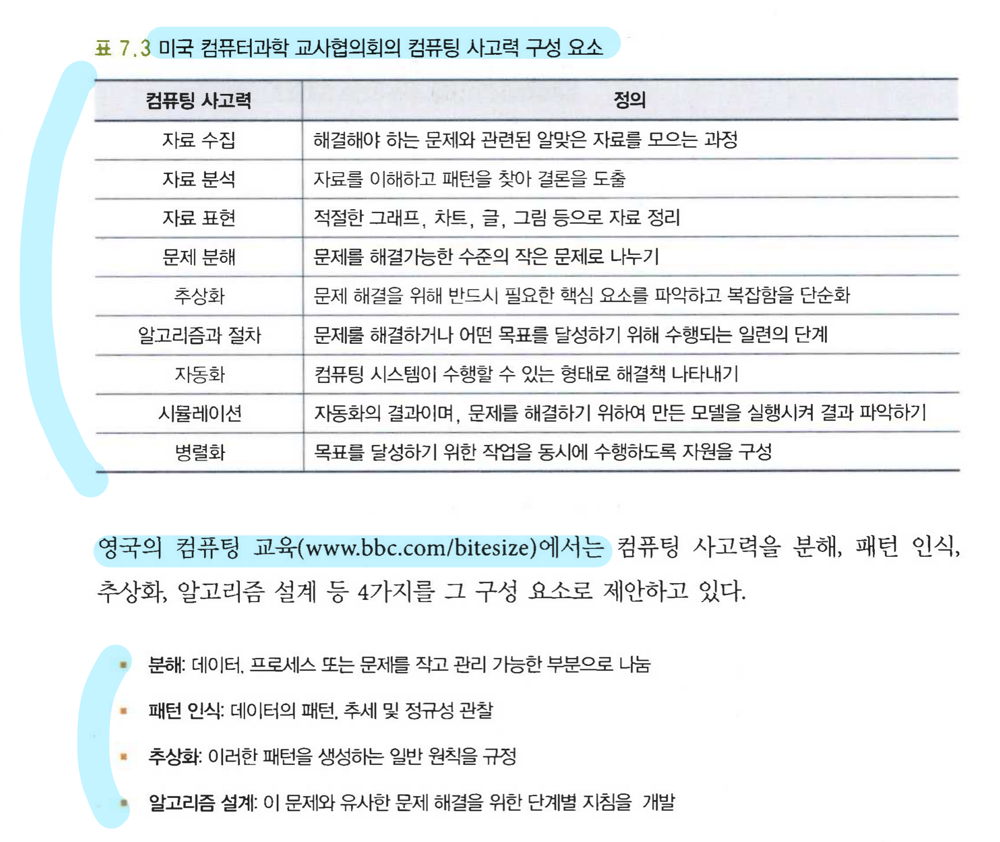

# 7장 컴퓨팅 사고력

## 컴퓨팅 사고력의 정의와 필요성

---

### 컴퓨팅 사고력

1980년 미국 MIT 대학의 시무어 페퍼트 교수가 처음으로 언급

2006년 카네기 멜론 대학의 자넷 윙 교수

🔸 컴퓨팅 사고력은 과학자 뿐만 아니라 누구나 배워서 활용할 수 있는 보편적인 사고이자 기술’이라고 제시

🔸 사람에게 필요한 읽기, 쓰기, 셈하기와 같은 근본적인 기술이 되어야 한다고 말한다.

컴퓨팅 사고력은 일반인도 배워야 할 기술로 인식되기 시작

### 컴퓨팅 사고력의 필요성

🔸 일상생활의 일반적인 문제 해결에 효율적으로 사용될 수 있는 방법을 제공할 뿐만 아니라 창의성을 높이는 데에도 기여하는 역량

🔸 창의, 문제해결, 융합 사고 능력도 함께 키울 수 있음

🔸 컴퓨터 기술을 근간으로 여러 산업이 융합하여 새로운 문제를 해결하는 제4차 산업혁명 시대의 도래에 따라 대부분의 해결해야 할 문제는 컴퓨터와 관련

## 컴퓨팅 사고력 구성요소와 특징

---

### 컴퓨팅 사고력 구성 요소

자넷 윙은 컴퓨터 사고력의 주요 구성 요소로 재귀적 사고, 병렬처리, 추상화, 분해 등의 요소를 제시하며,

추상화 과정과 자동화 과정을 제안하고 있다.

### 컴퓨팅 사고력 특징

자넷 위의 논문에서 제시한 컴퓨팅 사고력 특징

🔸 컴퓨팅 사고력의 핵심을 프로그래밍이 아닌 개념화에 있다.

🔸 컴퓨팅 사고력은 단순 반복적인 기술이 아닌 모든 사람이 갖춰야 하는 핵심 역량이다.

🔸 컴퓨팅 사고력은 컴퓨터가 아닌 인간의 사고방법이다.

🔸 컴퓨팅 사고력은 수학적 사고와 공학적 사고를 보완하고 결합한다.

🔸 컴퓨팅 사고력은 우리 모두를 위한 것이다.

미국의 컴퓨터과한 교사협의회에서 제시하는 컴퓨팅 사고력의 특징

🔸 문제를 해결하는 데 도움을 주는 다른 도구들과 컴퓨터를 사용하게 하는 방식으로 문제를 형성해가는 것

🔸 논리적으로 조직화하고 데이터를 분석하는 것

🔸 모델과 시뮬레이션 같은 추상화를 통해서 데이터를 표현하는 것

🔸 알고리즘적 사고를 통해서 해결책을 자동화하는 것

🔸 식별하고 분석하고 가장 효율적이고 효과적인 단계와 자원을 조합하여 목표달성과 함께 가능한 해결책을 실행하는 것

🔸 이 문제 해결과정을 다양한 문제들에 일반화하고 전이하는 것

## 자료 수집, 자료 분석과 표현

---

### 문제 수집

인터넷상에서 직접 자료를 찾을 수도 있으며, 설문이나 조사와 인터뷰 같은 의견청취, 공공데이터 또는 빅데이터 수집 등의 다양한 방법으로 자료를 수집할 수도 있다.

### 자료 분석

자료의 의미를 이해하고, 자료에서 특징을 찾아 일반화하거나, 자료가 가진 패턴을 찾아 자료의 흐름이나 동향을 파악하는 과정이다.

다양한 통계처리를 통한 분석이나 빅데이터 분석 등 전문적인 지식을 필요로 하는 경우가 많다.

적절한 자료 분석을 선택하여 수행하는 것도 중요하다.

### 자료 표현

서로의 관계나 특성을 파악

글, 차트, 그림 등으로 표현

표와 테이블, 계층 구조, 트리 구조, 그래프 다이어그램까지 다양

## 문제 분해

---

### 문제 분해란

하나의 복잡한 문제를 잘게 쪼개러 문제를 이해하고 해결하면 훨씬 문제가 쉬워진다.

작은 문제가 관리 가능하고 해결 가능하다면 문제 분해는 성공한 것이다.

### 분할과 정복

하나의 문제를 유형이 비슷한 하위 문제로 조금씩 나눠가면서 용이하게 풀 수 있는 문제 단위로 나눈 다음,

이를 해결하고, 다시 이를 합쳐서 해결하자는 개념이다.

1. 분할 : 분할 가능한 2개 이상의 작은 문제로 나눔
2. 정복 : 나뉜 문제를 다시 작은 문제로 나누던지 아니면 문제를 해결함
3. 합치기, 통합 : 해결한 작은 문제를 통합

ex) 이진 검색

이진 검색을 하려면 우선 정렬된 자료에서 검색을 시작

항상 중앙에 위치한 값과 찾는 값을 비교

그 값이 찾는 값이면 검색 종료

찾는 값이 아니면 왼쪽 그룹 또는 오른쪽 그룹으로 이동하여 다시 이직검색을 실시

## 다양한 분해 방법

---

### 책의 구성

큰 부분에서부터 작은 부분으로 처리하는 방식은 하향식(톱다운)방식이라고 한다.

목차를 구성하는 것

### 마인드 맵

넓은 의미에서 하나의 문제 분할 방법이다.

하나의 주어진 주제에 대하여 탑 다운 방식의 계층으로 표시하는 방법이다.

## 패턴인식과 추상화

---

### 패턴 인식

복잡한 문제를 효율적으로 해결하는 데 도움이 될 수 있도록 작게 분해된 문제들 사이의 유사성 또는 패턴을 탐색하는 과정이다.

🔸 문제에서 공통적인 요소나 기능을 식별

🔸 프로세스 또는 문제 사이에서 발생하는 공통적인 차이를 식별해서 해석

🔸 문제 내의 개별 요소를 식별

🔸 식별된 패턴을 설명하거나 기술

🔸 확인된 패턴을 기반으로 예측

### 추상화

간단히 형상을 뽑아낸다라는 의미

컴퓨터 사고력에서 추상화는 문제를 단순화시켜 불필요한 부분은 제거하고 핵심적인 요소와 개념, 기능을 간추려 내어 일반화된 모델을 만드는 과정을 말한다.

## 알고리즘과 자동화

---

### 알고리즘

문제를 해결하기 위해 추상화된 핵심 원리를 일련의 절차로 표현하는 과정이다.

단계별 지짐인 계획으로 이해하면 쉽다.

일련의 절차 : 순차적, 반복적, 조건 표현

공식화한 일련의 절차 표현 방법 : 순서도, 의사코드, 자연언어, 프로그래밍 언어 등

### 의사코드

슈도코드라고도 하는데, 우리가 사용하는 언어로 간결하게 알고리즘의 절차를 기술하는 방법

### 순서도

알고리즘을 표준화된 기호 및 도형으로 도식화하여 데이터의 흐름과 수행되는 절차들의 순서를 표현하는 방법

### 자동화

알고리즘을 구현하는 프로그래밍 단계
