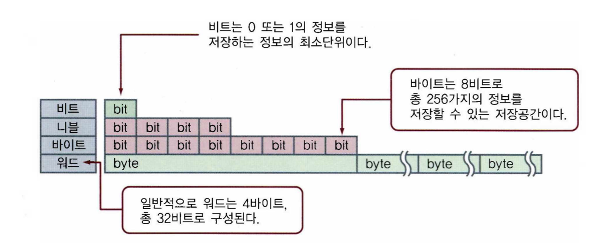

# 03주차 정보의 표현

# 컴퓨터의 자료 표현

---

### 10진수

우리가 흔히 사용하는 숫자를 10진수라 한다.

숫자가 0, 1, 2, 3, 4, 5, 6, 7, 8, 9까지 10개이므로 10진수라고 한다. 여기서 10을 기수(base)라 한다.

### 2진수

- 컴퓨터 내부에서 처리하는 숫자는 0과 1을 표현하는 2진수 체계를 사용
- 전기가 흐르거나(on, 참, 1) 흐르지 않는(off, 거짓, 0) 두 가지 전기 신호만으로 표현
  (트랜지스터를 이용하여 자료를 처리하고 저장)

### 비트와 바이트

**비트**

- 컴퓨터 메모리의 저장 단위 중 가장 작은 기본 정보 단위이다.
- 전기의 흐름 상태인 on과 off를 표현하는 단위이며, 2진수로 표현이 가능하다.

**바이트**

- 비트가 연속적으로 8개 모인 정보 단위이다.
- 총 256가지의 정보 종류를 저장할 수 있다.

**니블** : 바이트의 1/2크인인 4비트

**워드** : 바이트 4개

# 진수와 수의 표현

---

### 10진수

- 0에서 9까지의 열 가지의 수를 한 자리의 기본 단위로 사용하는 진법
- 인간이 일상 생활에서 이용하는 진수

## 진수의 변환

### 10진수를 2진수로 변환

- 주어진 값을 2로 나누고 몫이 0이되면 오른쪽으로 나열

### 10진수를 8진수로 변환

- 주어진 값을 8로 나누고 몫이 0이되면 오른쪽으로 나열

### 10진수 소수를 2진수로 변환

- 2를 곱하여 나온 결과에서 정수 부분으로의 자리 올림수와 소수점 아래 부분을 따로 보관
- 소수 부분이 0이면 3단계로 넘어가고, 아니면 소수점 아래 부분을 다시 새로운 10진수 소수로 취급하여 반복
- 구해진 정수 부분으로 자리 올림수를 순서대로 나열

### 2진수, 8진수, 16진수 간 상호관계

8진수 3자리

16진수 4자리

### 1의 보수

- 2진수의 비트를 0은 1로, 1은 0으로
- 이진수의 0100의 1의 보수는 1011
- +는 0000 -0은 1111

### 2의 보수

- 1의 보수에 +1

컴퓨터는 2의보수로 계산함, 음수는 1로 시작 그냥 정해놓음

# 컴퓨터의 정보 종류

---

### 정규화

정규화는 실수의 소수점을 이동하여 소수점 왼쪽에 단 하나의 자릿수가 나오도록 조정하고,

소숫점의 원래 위치는 진수의 지수로 표현하는 방법이다.

**부동소수**

정규화된 실수 표현이며 수의 소수점 위치를 움직일 수 있게 한다는 의미이다.

**지수** : 수의 크기를 표현

**가수** : 수의 정밀도를 표현

IEEE 754 부동소수 정규화 표준

**단정도** : 32bit / 127편향지수

**배정도** : 64bit / 1023편향지수

# 문자와 논리 표현

---

### 문자 코드의 이해

컴퓨터에서 문자는 하나의 정해진 수로 표현한다.

영문자는 7개의 비트의 조합으로 표현한다.

각각의 조합에 일정한 문자를 할당하여 지정한 것을 문자 코드라고 한다.

국제 표준인 문자코드는 아스키코드, 엡시딕코드, 유니코드 등이 있다.

### 아스키코드와 유니코드

**아스키코드**

아스키코드는 ASCII의 약자로, 미국 표준협회에서 국제적인 표준으로 정한 문자 코드이다.

아스키코드가 7비트를 이용하지만 실제로 한 문자는 8비트인 1바이트에 저장된다.

한 문자의 시작은 0으로 하고 나머지는 코드 값으로 구성된다.

**유니코드**

유니코드는 전 세계 모든 언어를 하나의 코드 체계로 통합하기 위하여 만들어졌다.

2바이트인 16비트로 확장된 코드 체계이다.

**UTF-8**

UTF-8은 유니코드를 위한 가변길이 문자 인코딩 방식 중 하나이다.

### 논리표현

참(True)과 거짓(False)을 의미하는 두 가지 정보를 논리값이라 한다.

AND, OR, NOT의 논리 연산을 ㅣ용한 부울대수는 조지 불이 창안했다.

# 컴퓨터의 연산

---

### 논리연산

AND는 . 으로, OR는 +로, NOT은 ‘ 로 표시한다.

### 논리함수

함수에서 입력 변수가 모두 1또는 0의 값만을 가지며, 결과값 역시 1또는 0만을 갖는 함수를 논리함수라 한다.

### 논리회로

