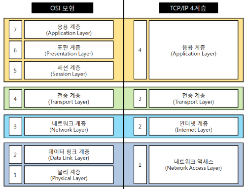

# 기말 정리

## 1. 강한 인공지능과 약한 인공지능

---

**🔹 강한 인공지능**

인간처럼 생각하고 행동하는 인공지능

범용 인공지능과 슈퍼 인공지능으로 분류

**🔹 약한 인공지능**

특정 데이터를 입력하고 프로그램을 통해 학습시킴으로써 특정한 문제를 해결하는 인공지능(알파고)

좁은 인공지능이라고 한다.

## 2. 퍼셉트론

---

1943년 워렌 맥컬럭은 인간 두뇌 신경에서 착한한 논리적 모델을 제시 → 인공신경망 퍼셉트론의 원류

1957년 프랭크 로젠블랫은 인공신경망의 근간이 되는 퍼셉트론을 개발

**다수의 신호를 입력받아서 하나의 신호를 출력하는 인공신경망**

## 3. 머신러닝과 딥러닝

---

### 머신러닝

🔹 1959년 아서 사무엘이 머신러닝이라는 용어를 처음 사용

🔹 **명시적으로 프로그래밍을 하지 않아도 컴퓨터가 학습을 할 수 있도록 해주는 인공지능의 한 형태**이다.

### 머신러닝 수행 과정

1. 데이터 수집
2. 데이터 전처리 : 누락된 값을 채우고 이상 값을 수정하거나 제거, 잘못된 값은 수정, 정규화
3. 모델 학습
4. 모델 성능 시험과 개선(성능개선)
5. 데이터와 결과 시각화

### 딥 러닝

**인간의 뇌에서 영감을 받은 인공 신경망을 사용하여 데이터를 학습하고 패턴을 인식하는 기술**

여러 층으로 구성된 심층 신경망을 통해 복잡한 데이터에서 특징을 추출하고 분석하는 데 강점

## 4. 경사하강법

---

**함수의 기울기를 이용해 최소값을 찾아가는 반복적인 최적화 방법**

## 5. 자료와 정보의 차이

---

**자료는 사실이나 값의 집합으로, 가공되지 않은 상태의 원시 자료**

**정보는 자료를 가공하여 의미 있는 형태로 변환한 결과물**

## 6. 알고리즘

---

**문제를 해결하기 위한 일련의 단계적 절차 또는 방법**

## 7. 객체란

---

**데이터와 그 데이터를 처리하는 함수를 묶어놓은 것**

## 8. 정보통신의 구성요소

---

**송신자, 수신자, 전송매체, 프로토콜**

## 9. 대한민국 인터넷의 아버지

---

**전길남**

## 10. OSI 7계층과 TCP/IP 비교

---

## 접속장치

---

**두 대 이상의 컴퓨터나 기기를 연결하여 네트워크를 형성하고 데이터를 주고받을 수 있게 하는 하드웨어 장치**

## 프로토콜

---

**두 대의 컴퓨터 사이나 중앙 컴퓨터와 단말기 사이에서 데이터 통신을 원활하게 하기 위해 필요한 통신 규약**

두 대의 컴퓨터가 데이터를 전송할 때 무엇을 어떻게 어떠한 방식으로 교신할 것인가를 정한 절차
