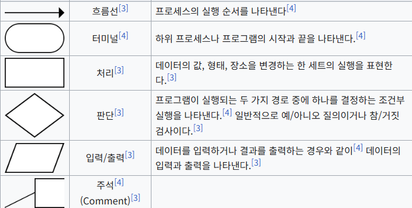

# 03 순서도

## 알고리즘의 표현 방법 (순서도)

---

### 순서도

🔹 순서도는 플로차트(flowchart)라고 한다. 알고리즘을 약속된 도형을 이용하여 그림으로 표현하는 방법

🔹 순서도로 알고리즘을 표현하면 각 기능을 명확하게 표현할 수 있고,

도형의 의미만 이해하면 알고리즘을 쉽게 이해할 수 있다.

🔹 컴퓨팅 사고에서 알고리즘을 순서도로 표현하는 연습을 많이 하면

직접적인 코딩교육을 받지 않아도 컴퓨팅 사고력을 높일 수 있다.

🔹 컴퓨터 과학 분야에서 순서도에서 사용하는 도형은 국제 표준화 기구에서 1965년 표준안으로 결의된

기호를 사용한다. 기호를 사용할 때 아래 규칙을 따라야 한다.

<aside>
💡

1. 기호의 내부에는 처리해야 하는 내용이 들어가 한다.
2. 순서는 위에서 아래로, 왼쪽에서 오른쪽을 원칙으로 하며
    
    그 외의 경우는 화살표를 사용해야 한다.
    
3. 흐름선은 서로 교차해도 무관하며 서로 영향을 주지 않는다.
4. 흐름선 여러 개가 모여서 하나로 합쳐질 수 있다.
5. 기호의 모형 크기는 정해져 있지 않으나 모양은 잘 구분할 수 있도록 표현해야 한다.
</aside>

### 순서도 기호

## 알고리즘의 구조

---

🔹 컴퓨터 과학 분야에서 알고리즘 수행을 정의할 때 정해진 흐름 제어 방식을 사용해야 한다.

🔹 알고리즘을 표현할 때 정해진 흐름 제어 방식을 알고리즘의 구조라고 하며,

컴퓨터 과학 분야에서는 세 가지 기본 제어구조를 갖는다.

🟨 순차 구조

🔹 시작부터 차례대로 진행되어 끝까지 명령어를 실행하는 구조이다.

🔹 알고리즘 수행 흐름이 아래쪽 한 방향으로 진행된다.

🟨 선택 구조

🔹 조건에 따라 실행 흐름이 달라지는 구조이다.

🔹 알고리즘 수행 흐름이 여러 방향으로 나뉘어 진행된다.

🟨 반복 구조

🔹 동일한 명령어가 반복되면서 실행되는 구조이다.

🔹 알고리즘 수행 흐름이 되돌아가는 방향으로 진행된다.