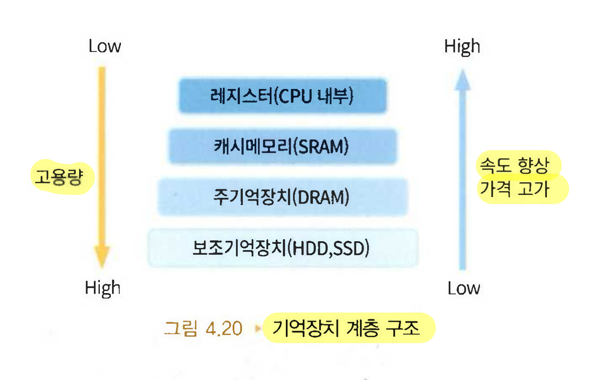

# 05주차 컴퓨터 구조

# 폰 노이만의 프로그램 내장 방식

---

폰 노이만이 고안한 저장 프로그램 방식은 주기억장치에 자료뿐만 아니라

프로그램도 저장하는 프로그램 내장 방식을 말한다.

## 명령어 형식

명령어는 연산 부분(연산)과 피연산 부분(주소)으로 구성된다.

연산 부분 : 명령어가 수행해야 할 기능을 의미.

**피연산 부분** : 연산에 참여하는 자료를 의미

16비트 명령어 → 4비트는 연산 종류 나머지 12비트는 피연산자의 메모리 주소를 나타냄

피연산자 수는 없거나 2개 또는 3개인 명령어도 있다.

피연산자는 메모리 주소 또는 레지스터가 될 수 있다.

## 명령어 종류

ADD(add), LDA(load address), STA(store address), HLT(halt) 등의 기호 단어를 이용한 연산자와

A, B, C(주소를 의미) 등의 피연산자의 이름으로 명령어를 기술

| 명령어 | 구문 형식 | 기능                                                         |
| ------ | --------- | ------------------------------------------------------------ |
| ADD    | ADD A     | 피연산자의 자료 A와 레지스터의 자료를 더하는 명령어          |
| LDA    | LDA B     | 피연산자의 자료B(주소 B의 자료)를 레지스터에 가져오는 명령어 |
| STA    | STA C     | 레지스터의 내용을 피연산자 C(주소 C)에 저장하는 명령어       |
| HLT    | HLT       | 컴퓨터를 종료하는 명령어                                     |

## 저급언어

사람에게 친숙하지 않아 이해하기 어려우나 컴퓨터에게 작업을 지시할 수 있는 언어

### 기계어

컴퓨터를 작동시키기 위해 0과 1로 표현한 컴퓨터 고유 명령 형식 언어

### 어셈블리어

컴퓨터 명령어인 기계어를 사람이 일상 생활에서 사용하는 자연어와 유사하게 만든 것

연산자와 피연산자를 몇 개의 문자 조합으로 기호화 해서 나타낸다.

# 다양한 기억장치

---

## 주기억장치(RAM)의 구조

### 주소

메모리의 저장소는 주소(address)를 이용하여 각각 바이트 단위로 고유하게 식별할 수 있다.

컴퓨터가 한 번에 작업할 수 있는 데이터의 크기를 워드 크기(word size)라 한다.

워드는 32비트이거나 64비트이다.

### 버스

연결해 주는 통로를 시스템 버스라 한다.

**시스템 버스**

- 주소(address)버스
  cpu가 어디(메모리주소)에 접근할 지 지정
  단방향
- 자료(data)버스
  자료를 전달하는 연결 경로(실제 데이터 값을 전달)
  양방향
- 제어(control)버스
  동작제어 신호를 주고받음
  양방향

ex) 주소버스 : 택배 주소 / 자료버스 : 택배 물건 / 제어버스 : 택배 지시서(보내기, 받기, 긴급 등)

## RAM과 ROM

### 주기억장치 RAM(Random Access Memory)

- 유일한 숫자인 메모리 주소로 메모리의 특정 위치의 내용을 어디든지 바로 참조할 수 있다는
  의미에서 ‘임의 접근 메모리’라 한다.
- 소멸성(=휘발성 메모리) 기억장치이며 정보의 쓰기와 읽기가 가능하다.

### RAM의 종류

- **DRAM**
  전원이 연결된 상태에서 일정한 주기마다 재충전하는 리프레쉬를 해 주어야만 정보가 지워지지 않는다.
  우리가 흔히 사용하는 것
- **SRAM**
  전원만 연결되어 있으면 정보가 지워지지 않는 기억장치이다.
  DRAM보다 빠르고 비싸며 캐쉬 메모리에 주로 사용한다.

<aside>
💡

CPU가 메모리에서 데이터를 읽고 싶을 때 예시 (ppt자료)

1. 주소버스에 원하는 메모리 주소를 보냄
2. 제어버스에 “읽기(Read)” 신호를 보냄
3. RAM이 그 주소의 데이터를 자료버스를 통해 CPU로 보냄
4. CPU는 그 데이터를 사용
</aside>

### ROM(Read Only Memory)

읽기 전용 메모리로 한 번 저장된 자료는 더 이상 쓰기를 할 수 없고 읽기만 가능한 메모리다.

비소멸성(비휘발성)이며 메모리에 임의 접근이 가능하다.

### ROM의 종류

- **마스크 ROM**
  기억된 데이터를 지우거나 변경 불가능
- **PROM**
  임의의 프로그램을 기억시킬 수 있음
- **EPROM**
  자외선 또는 X선 등을 이용하여 데이터를 지우거나 입력 가능함

### BIOS

- 컴퓨터 부팅을 위한 펌웨어(firmware)
- 컴퓨터의 전원이 연결되면 바이오스는 먼저 POST 실행

### POST

- 일련의 시동자체시험 과정
- 주기억장치와 보조기억장치, 컴퓨터 키보드, 그래픽 카드 등 주변장치 연결 확인
- 관련 하드웨어의 이상 여부를 확인하는 초기화 작업 수행
- 보조기억장치의 연결에 문제가 있거나 보조기억장치 내의 운영체제 파일에 문제가 있다면 바이오스는 부팅 불가 메시지를 출력
- POST 과정에서 아무 문제가 없다면 운영체제를 컴퓨터의 메모리이 RAM에 로드(load)

## 캐시 메모리와 버퍼

### 캐시 메모리

주변기기의 속도를 빠르게 하는 대표적인 방법이다.

- CPU에 비해 상대적으로 주변기기의 속도가 매우느림
- 주기억장치와 CPU의 속도의 차이를 해결
- 캐시 메모리는 메인 메모리보다 대개 약 10배쯤 더 빠름
- 저장 속도가 빠르고 고가인 SRAM을 이용

### 캐시의 수준

- CPU에 가깝게 위치한 수준-1캐시, CPU에서 떨어져 있는 수준-2캐시
- 디스크 캐쉬 : RAM과 디스크 사이에 일정량의 임시메모리

### 버퍼

속도의 차이가 나는 두 장치 간에 효율적인 작업 처리를 위한 임시 저장 공간이다.

필요성

- 프로세서의 속도는 입출력 주변장치의 속도보다 훨씬 더 빠름
  (프로세서는 주변장치의 응답을 기다리다 시간을 허비할 수 있음)
- 이를 방지하기 위해
  → RAM의 일부를 임시저장 공간인 버퍼 메모리로 사용
  - 입출력장치로 전달될 데이터를 일시적으로 저장가능
  - 그동한 프로세서는 다른 요청이나 작업을 계속 수행 가능

## 다양한 보조기억장치

### 보조기억장치

주기억장치보다 가격이 싸며, 전원이 없어도 대용량의 자료를 영구적으로 저장할 수 있는 기억장치

보조 기억장치는 CPU외부에 위치함

- 순차접근 : 자기 테이프와 같은 저장장치는 순차적으로 접근
- 직접접근 : 자기 디스크와 자기 드럼은 원하는 위치에 바로 쓰고 읽는 직접 접근

1. **HDD(Hard Disk Drive)**

   헤드를 이용하여 여러 개의 원형 알루미늄 기판인 디스크에 자료를 저장하는 방식

1. **SSD(Solid State Disk)**

   SSD는 플래시 메모리와 이를 제어하는 컨트롤러로 구성된 대용량 저장장치

   HDD와 비교해 속도가 빠르며, 전력 사용량이 적고 충격에 강하며, 발열과 소음도 적다

   SSD는 가격이 비싼 편이라, SSD에 운영체제와 자주 사용하는 응용프로그램을 설치하고,

   HDD에는 영화나 음악 같은 대용량 자료를 저장하여 함께 사용하는 경우가 늘고 있다.

1. **플래시 메모리**

   RAM과 ROM의 장점을 합친 메모리이다.

   소비전력이 적고, 비소멸성(비휘발성) 메모리이다.

   디지털 텔레비전, 디지털 캠코더, 휴대전화, 디지털 카메라, 게임기, MP3, USB 메모리 등에 이용된다.

## 기억장치의 계층 구조

### 속도와 용량

# 중앙처리장치 CPU(Central Processing Unit)

---

메모리에 저장된 프로그램과 자료를 이용하여 실제 작업을 수행하는 전자회로 장치이다.

구성

- 자료와 연산을 수행하는 연산장치
- 컴퓨터의 작동을 제어하는 제어장치
- 연산에 필요한 자료를 임시로 저장하는 레지스터

중앙처리장치 내부에도 자료 버스와 제어 버스가 연결되어 있다.

## 연산장치 ALU

### 산술연산과 논리연산

연산장치는 산술연산 모듈과 논리연산을 수행하는 모듈로 구성된 회로이다.

### 레지스터 연산

중앙처리장치의 임시 기억장소인 누산 레지스터와 자료 레지스터에 저장된 자료를

연산에 참여할 피연산자로 이용한다.

결과는 다시 누산 레지스터에 저장되어 필요하면 주기억장치에 저장되거나 다른 연산에 이용될 수 있다.

## 제어장치

- 산술 및 논리 연산에 요구되는 작업을 연속적으로 수행하는 신호를 보냄으로써
  연산장치와 레지스터가 명령을 수행하게 하는 장치이다.
- 해독기와 제어기로 구성
- 인간의 ‘뇌’와 같은 역할을 한다.

## 레지스터

중앙처리장치에서 내부 처리 연산에 필요한 다양한 임시 기억장소를 의미한다.

| 레지스터 심볼     | 레이스터 이름                                              | 기능 |
| ----------------- | ---------------------------------------------------------- | ---- |
| DR                | 자료 레지스터                                              |
| (Data)            | 연산에 필요한 피연산자를 저장하는 레지스터                 |
| AR                | 주소 레지스터                                              |
| (Address)         | 현재 접근할 기억장소의 주소를 기억하는 레지스터            |
| AC                | 누산 레지스터                                              |
| (Accumulator)     | 연산장치의 입출력 데이터를 임시적으로 기억하는 레지스터    |
| IR                | 명령어 레지스터                                            |
| (Instruction)     | 현재 수행 중인 명령어를 저장하고 있는 레지스터             |
| PC                | 프로그램 카운터                                            |
| (Program Counter) | 다음에 실행할 명령어의 메모리 주소가 저장된 레지스터       |
| TR                | 임시 레지스터                                              |
| (Temporary)       | 임시로 자료를 저장하는 레지스터로 범용 레지스터라고도 부름 |

## 명령어 처리 과정

### CPU와 주기억장치 간의 자료 전송

주기억장치의 명령어와 자료가 중앙처리장치의 여러 임시 저장소인 레지스터로 전송되어 명령어를 처리한 후,

처리 결과가 다시 주기억장치로 전송되는 과정을 거친다.

### 기계주기

중앙처리장치는 하나의 명령어를 실행하기 위해 인출(fetch), 해독(decode), 실행(ex-ecution)의 세 과정을 거쳐 하나의 명령어를 실행한다. 이러한 과정을 기계주기라 한다.

# 마이크로프로세서

## 마이크로프로세서 성능

사이클당 연산 수와 자료 버스의 폭, 레지스터의 수와 크기, 캐시메모리의 크기 등으로 결정된다.

### 자료 버스 폭

자료 버스 폭은 마이크로프로세서의 워드 크기와 비례하며 워드 크기와 같거나 더 크다.

### 클럭 속도

시스템 클럭은 수정 진동자를 사용하는데 전원이 공급되면 초당 수백만 회의 진동수를 일정하게 유지한다.

컴퓨터는 이 진동수에 맞추어 연선을 처리하는 시간을 조절한다.

클럭 주파수는 컴퓨터가 명령어를 수행하는 속도를 결정한다.

클럭의 속도가 빠를수록 컴퓨터의 처리 속도도 빨라진다.

### 병렬처리

하나의 컴퓨터에서 2개 이상의 CPU를 이용하여 한 번에 여러 개의 명령어를 동시에 실행시키는 처리 방법이다.

### 컴퓨터의 성능

CPU 처리 속도에 영향을 미치는 요인

- 레지스터의 크기
- 클럭 속도
- 버스 폭
- 캐시 메모리 크기

## 주요 마이크로프로세서

### 인텔

마이크로프로세서를 생산하는 대표적인 회사는 인텔이다.

인텔의 8088 프로세서에 탑재하여 출시하면서 인텔은 눈부시게 성장했다.

그 외 펜티엄, 아이텐엄, 코어 i3, i5, i7, i9를 출시하고 있다.

### 무어의 법칙

인텔의 공동 설립자인 고든 무어가 한 연설에서

“마이크로 칩의 처리 능력은 18개월마다 두 배로 증대된다.”라고 한 내용에서 유래한 것이다.

## 명령어에 따른 프로세서 분류

마이크로프로세서는 프로세서마다 고유한 명령어 집합을 제공한다.

### CISC (PC, 노트북,…)

- 복합 명령어 집합으로 구성
- 복잡한 프로그램을 적은 수의 명령어로 구성할 수 있는 장점
- 복잡한 명령어의 실행을 위한 복잡한 회로가 이용됨
- 생산가가 비싸고 전력 소모가 많아 열이 많이 발생하는 단점

### RISC (모바일)

- 축소 명령어 집합으로 구성
- 명령어의 수가 적고 구조도 단순

| 항목            | CISC                                | RISC                                  |
| --------------- | ----------------------------------- | ------------------------------------- |
| 명령어 수       | 많고 복잡한 명령어 포함             | 단순하고 작은 명령어 사용             |
| 명령어 길이     | 가변 길이                           | 고정길이                              |
| 실행 속도       | 한 명령에 많은 작업 → 느릴 수 있음  | 명령어당 처리 속도 빠름               |
| 하드웨어 복잡도 | 복잡함                              | 간단함                                |
| 대표 CPU        | 인텔 x86, AMD 등                    | ARM, MIPS, RISC-V 등                  |
| 메모리 접근     | 명령어 내에서 직접 메모리 접근 가능 | 보통 명령어는 레지스터 간 연산만 수행 |
| 사용            | 일반 pc/노트북                      | 모바일, 저전력 디바이스               |
