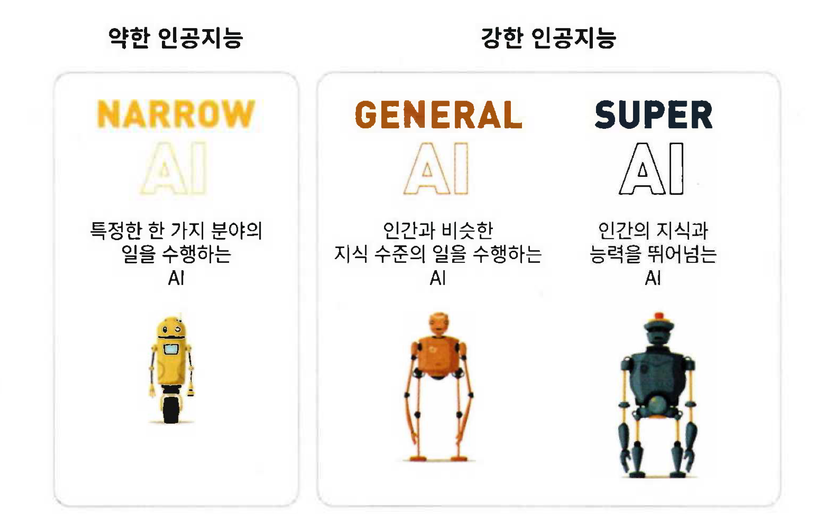
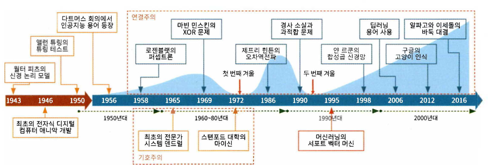
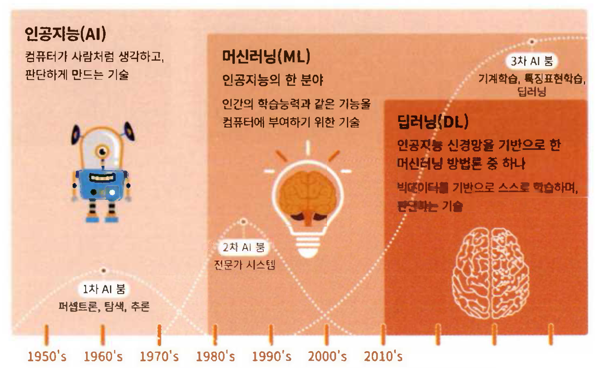
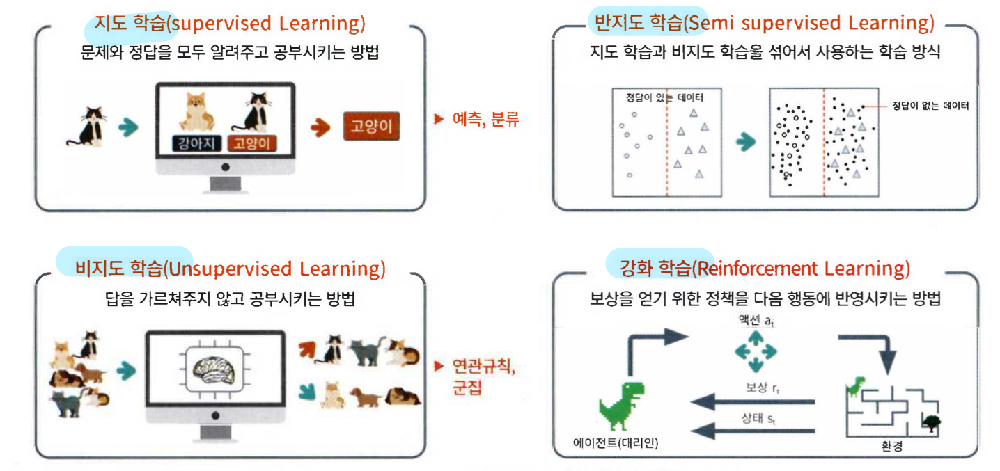
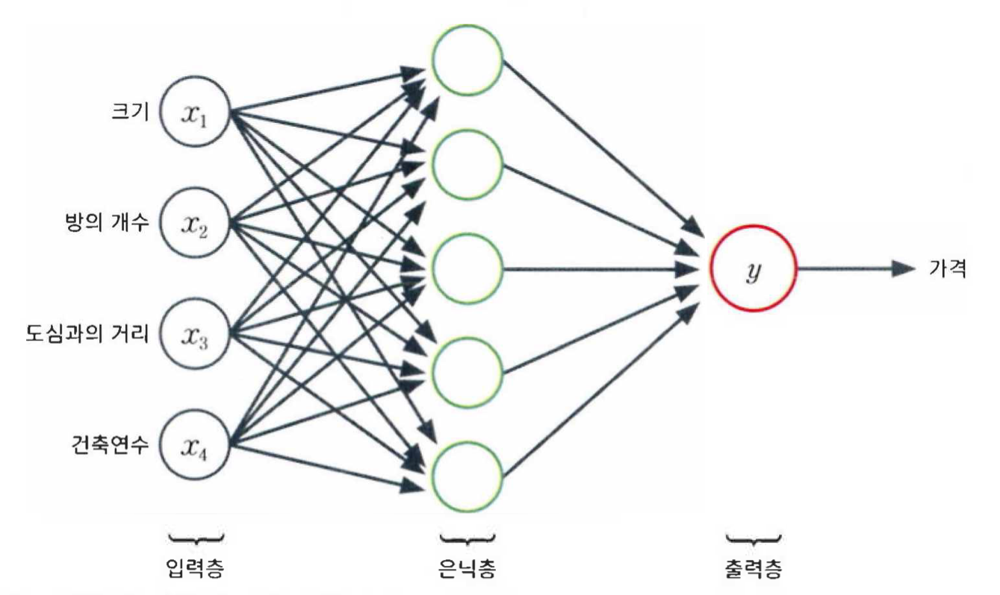

# 6장 인공지능과 딥러닝

## 인공지능

---

인공지능은 ‘사고나 학습, 문제해결 능력 등 인간 지능 수준의 지적 능력을 컴퓨터 하드웨어와 소프트웨어로 구현하는 기술’이다.

인공지능은 강한 인공지능과 약한 인공지능으로 구분한다.

## 인공지능 역사

---

### 1940~1950 인공지능 태동기

**1943년**

워렌 맥컬럭 : 인간 두뇌 신경에서 착안한 논리적 모델을 제시 → 이 모델이 인공신경망 퍼셉트론의 원류이다.

앨런 튜링 : ‘튜링 테스트’를 제안

**1956년**

존 매카시 : 다트머스 회의에서 ‘인공지능’이라는 용어를 처음 사용, 인공지능이 학문 분야로 발전하는 계기가 되었다.

**1957년**

프랭크 로젠블랫 : 퍼셉트론을 개발, 퍼셉트론은 인간의 뇌 신경에서 아이디어를 얻어 여러 신호를 입력받아 하나의 신호를 출력하는 모델이다.

### 기호주의와 연결주의

1950년대의 인공지능 연구 주류는 기호주의와 연결주의 분야이다.

기호주의 : 인간의 지능과 지식을 기호화하여 학습시키는 방법

연결주의 : 두뇌 신경 조직을 모형화하고 여러 신경을 네트워크 구조로 연결해 연결 강도를 학습시키는 방법

### 인공지능의 첫 번째 겨울

1969년

기호주의의 마빈 민스키와 시모어 페퍼트 → 퍼셉트론이 XOR같은 문제도 해결할 수 없다고 증명

‘XOR문제’ 이후에 민스키의 기호주의 학문으로 관심이 집중되는 계기

1970년대에 걸쳐 이어졌던 이 침체기를 인공지능의 첫 번째 겨울이라 부른다.

### 인공지능의 두 번째 겨울

1990년대에 접어들면서 입력 데이터에서 특징의 수가 증가, 구조가 복잡해지면서 여러 문제 발생

인공신경망에서 뉴런 층이 많아질수록 예상과 달리 여러 문제 발생

2000년 중반까지 또 한번의 겨울을 맞이함

1995년 이후 활성화된 머신러닝

머신러닝은 컴퓨터가 대량의 데이터를 기반으로 스스로 학습하고 통계적인 결과를 도출하는 인공지능의 한 분야이다.

### 딥러닝의 중흥기

1998년

얀 르쿤 : 이미지 처리분야 등에 널리 활용되는 **합성곱 신경망(CNN)** 기술 발표

2006년

힌튼 : 기술적 해결책을 제시해 심층 신경망도 학습이 가능하다는 것을 밝혀냄 → 신경망에 deep을 붙여 심층신경망(DNN) 용어를 사용 → 본경적인 딥러닝 시대가 찾아옴

2012년

구글 브레인과 스탠포드의 앤드류 응 교소 : 유튜브의 1000만 마리 고양이 얼굴 인식

ILSVRC대회에서 CNN기반의 알렉스넷은 이미지 인식 오차율이 15%로 다른팀에 비해 10%가 낮을 기록으로 우승

2016년

구글 딥마인드의 알파고 이세돌에게 승리

인공지능이라는 용어를 우리에게 각인시켰고 사람들은 인공지능의 발전에 두려움까지 느끼게 되었다.

## 일상에서의 인공지능

---

### 음성인식과 번역, 자연어 처리

🔸 애플의 시리, 삼성전자의 빅스비 등 이 음성인식 소프트웨어이다.

### 영상인식과 의료영상 분석

🔸 얼굴을 인식해 온도를 측정하는 기기,

🔸 \*\*\*\*흉부 엑스레이 사진을 인공지능 기술로 분석해 주요 폐질환을 97%의 정확도로 검출해냄

### 이미지와 동영상 모방 생성

🔸 이안 굿펠로가 만든 생성적 적대 신경망(GAN)이 활용되면서 인공지능은 모방과 창조가 가능해짐

🔸 2017년 버클리 대학 인공지능 연구소 : 순환 GAN 모델을 개발

🔸 딥페이크 : 원본 이미지나 동영상 위에 다른 영상을 중첩하거나 결합하여 다른 콘텐츠를 생성하는 기술

2017년 워싱턴 대학 컴퓨터공학부 연구팀은 오바마 목소리에 맞춰 립싱크로 말하는 ‘오바마AI’를 만들었다.

🔸 딥페이크는 산업적 활용가치가 높아 영화 음반 등 다양한 분야에서 활용이 가능

하지만 가짜 뉴스 등의 심각한 문제도 발생함

### 추천서비스, 이상 감지 등에 사용되는 인공지능

🔸 유튜브나 넷플릭스를 어느 정도 사용하면 내가 좋아할 만한 영상이 추천된다.

🔸 개인의 취향과 관심에 맞는 것을 찾아주는 개인화된 맞춤형 추천서비스

🔸 자신의 선택 이력과 다른 사용자의 선택 이력 자료를 기반으로 학습을 통해 개인화된 맞춤형 추천서비스가 가능

🔸 여러 컴퓨터에서 메일을 사용하면 자신이 맞는지 확인

🔸 카드나 은행의 부적절한 거래 감지

## 인공지능의 미래 ‘특이점’

---

인공지능이 인간 뇌의 능력을 넘어서는 순간을 ‘특이점’이라 한다.

특이점이란 말은 1950년대에 처음 등장했다.

2029년에 가능할 것으로 예측한다.

## 인공지능과 머신러닝, 딥러닝

---

### 머신러닝

🔸 1959년 아서 사무엘이 머신러닝이라는 용어를 처음 사용

<aside>
💡

“머신러닝은 컴퓨터가 인간처럼 학습하고 행동하도록 하는 과학이며,
관찰 및 실제단어의 상호작용 형태로 데이터와 정보를 제공함으로써
시간이 지남에 따라 자율적으로 학습을 향상시키는 과학이다.”

</aside>

🔸 기계학습이라고도 부름

🔸 주어진 데이터를 기반으로 기계가 스스로학습하여 성능을 향상시키거나 최적의 해답을 찾기 위한 지능적 학습 방법

🔸 명시적으로 프로그래밍을 하지 않아도 컴퓨터가 학습을 할 수 있도록 해줌

🔸 더 많은 데이터가 유입되면 컴퓨터는 학습을 더 많이 하고, 시간이 흐르면서 스마트해져서 능력과 정확도가 향상된다.

### 머신러닝과 전통적 프로그래밍의 차이

전통적 프로그래밍

input + program = output

머신러닝

input + output = program

## 머신러닝 절차와 주요 용어

---

### 머신러닝 수행 과정

1. 데이터 수집
2. 데이터 전처리
   1. 누락된 값을 채우고 이상 값을 수정하거나 제거하며, 잘못된 값은 수정하는 데이터 정리 필요
   2. 정규화 과정
3. 모델 학습
4. 성능 시험과 개선
5. 시각화

## 다양한 머신러닝 기술 분야

---

### 머신러닝 분류

머신러닝은 지도 학습과 비지도 학습, 반지도 학습 그리고 강화 학습으로 나뉜다.

### 지도 학습과 활용

🔸 지도 학습이란 정답이 있는 훈련 데이터로부터 입출력 간의 함수인 모델을 학습시키는 방법이다.

🔸 입력값 X_data가 주어지면 정답인 Y_data로 학습시킨다.

🔸 지도 학습으로 분류와 회귀 문제를 해결한다.

분류 : 주어진 데이터를 정해진 정답 유형에 따라 분류하는 문제

    ex) 신용카드 부정사용 감지

회귀 : 입력 데이터로부터 연속된 출력값을 예측하는 문제

### 비지도 학습과 활용

🔸 비지도 학습은 정답이 없는 훈련 데이터를 사용하여 데이터 내에 숨어있는 어떤 관계를 찾아 내는 방법이다.

🔸 정답 레이블이 없는 데이터를 비슷한 특징끼리 군집화해 새로운 데이터에 대한 결과를 예측하는 방법이다.

🔸 비지도 학습의 대표적인 종류는 군집화이다.

### 강화 학습과 활용

🔸 강화 학습은 주어진 현재 상황에서 보상을 최대화 하도록 다음 행동을 학습시키는 방법이다.

🔸 agent : 학습 주체인 대리인

🔸 알파고가 강화학습을 사용한 예다.

## 지도 학습의 대표적 알고리즘

---

### 선형 모델

🔸 선형 모델 : 데이터 특성에 대한 선형 함수를 만들어 예측하는 기법이다.

🔸 선영 회귀 : 데이터에 가장 적합한 선을 찾는 방법

🔸 선형 분류 : 유형 클래스를 분류하는 가장 적합한 선을 찾는 방법

### K-최근접 이웃(KNN) 알고리즘

지도 학습인 K-최근접 이웃 알고리즘은 가장 간단한 알고리즘으로 회귀와 분류에 모두 사용된다.

## 비지도 학습의 대표적 알고리즘

---

### K-평균 군집화 알고리즘

주어진 데이터를 비슷한 군집으로 묶는 알고리즘으로 간단히 KC 또는 K-평균 알고리즘이라 부른다.

## 퍼셉트론과 인공신경망

---

1970년 프랭크 로젠블랙 : 세계 최초로 인공신경망인 퍼셉트론을 제시

퍼셉트론은 다수의 신호를 입력받아서 하나의 신호를 출력한다.

### 가중치와 편향

입력 특성이 하나이면 가중치는 기울기이며, 편향은 절편을 의미한다.

### 활성화 함수

활성화 함수 : 퍼셉트론에서 최종 값을 결정하는 함수

항등 함수 : 가장 단순한 활성화 함수 f(x)=(x)

활성화 함수 종류 : ReLU, 시그모이드 함수, 하이퍼볼릭탄젠트 함수

### 간단한 인공신경망

가장 간단한 인공신경망(ANN)과 퍼셉트론의 출력층으로 구성된다.

### 다층 퍼셉트론(MLP)과 심경심층망(DNN)

다층 신경망 : 가로로 여러 개 연결한 층을 쌓으면

은닉층 : 입력층과 출력층 사이 → 은닉층의 단계가 많아질 수록 더 깊은 딥러닝이 된다.

딥러닝이라고 불리는 심층신경망(DNN)은 입력층과 출력층 사이에 여러 개의 은닉층들로 이뤄진 인공신경망이다.

현재의 딥러닝은 적게는 몇 개에서 많게는 수백 개의 은닉층으로 구성된다.

### 경사하강법 : 손실 값을 줄이는 방법

‘경사 따라 내려가기’ 방식으로 기울기를 계산해 기울어진 방향으로 조금씩 이동하는 과정을 반복적으로 수행해 기울기가 최소가 되는 지점으로 이동하는 방식이다.

## 다양한 인공신경망 라이브러리

---

인공신경망을 위한 공개된 프레임워크는 툴킷 또는 라이브러리라는 용어로도 사용된다.

### 구글의 텐서플로

2015년 11월 구글이 공개한 머신러닝과 딥러닝을 위한 오픈소스 플랫폼이다.

### 케라스

프랑소아 숄레가 파이썬으로 개발한 오픈소스 라이브러리로 텐서플로 등의 인공신경망 엔진에서 지원하는 고수준 API 라이브러리다.

### 파이토치

파이썬을 위한 오픈소스 머신 러닝 라이브러리이다.

페이스북 인공지능 연구팀에서 개발 → 2016년 오픈소스로 공개 2018년 12월 1.0 버전 정식 출시

테슬라의 오토파일럿이나 우버의 파이로가 파이토치로 만들어진 대표적인 인공지능 소프트웨어다.
