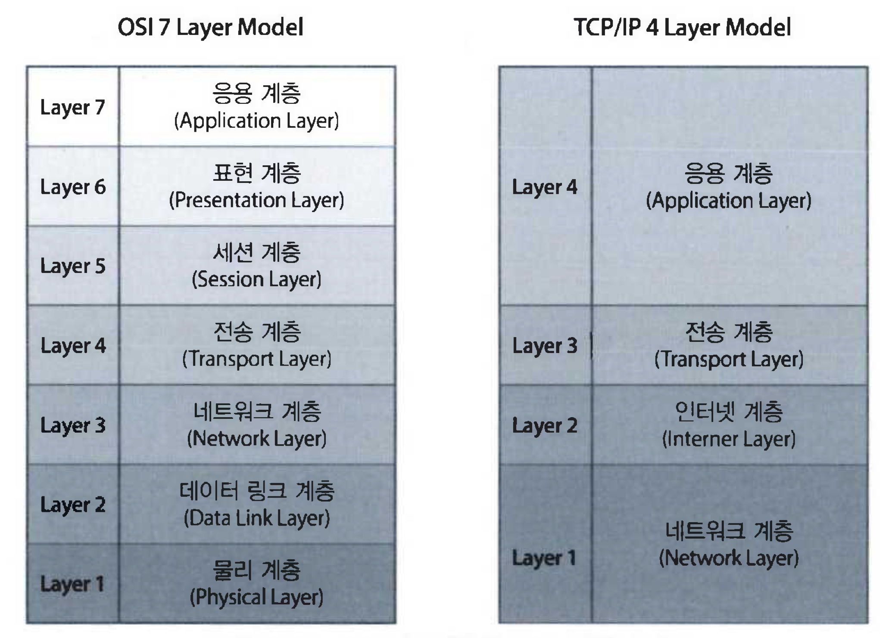

# 10장 네트워크와 www

## 네트워크 개요

---

### 컴퓨터 네트워크

🔸 전송 매체를 통하여 연결되어 진 컴퓨터들이 상호 간에 정보를 교환하는 시스템을 말한다.

🔸 데이터를 송신하는 송신자와 수신하는 수신자 그리고 그 사이의 전송매체로 이루어진다.

프로토콜 : 무엇을 어떻게 어떠한 방식으로 교신할 것인가를 정한 절차 또는 규약

프로토콜 종류 : TCP, IP, UDP, HTTP 등

🔸 1960년 미국 국방성에서 ARPANET을 만들었다.

🔸 1972년 IBM은 SNA를 만들었다.

🔸 1974년 제록스가 이더넷을 개발

🔸 1982년 TCP/IP

🔸 1986년 NSF가 NSFNET을 ATPANET에 연결

🔸 1990년 WWW개발

### OSI 7계층

물리, 데이터링크, 네트워크, 전송, 세션, 표현, 응용의 모두 7개로 구성된 모델

7개 계층은 서로 간에 독립적 → 어느 한 계층의 변경이 다른 계층에 영향을 미치지 않는다.

🔸 물리 계층

전송매체로 비트들을 전송하는 기능

네트워크 장치들의 기계적이고 물리적인 사양은 이 물리계층에 의해 결정된다.

🔸 데이터링크 계층

비트들을 프레임이라는 논리적인 단위로 구성

전송하려는 데이터에 인접하는 노드의 주소가 더해진다.

물리 계층에서 발생할 수 있는 오류를 검출하고 복구하는 오류 제어 기능

🔸 네트워크 계층

데이터의 발신지와 목적지 간의 패킷이 전송되는 경로를 책임진다.

논리 주소인 IP 주소를 헤더에 포함하여 전송

🔸 전송 계층

메시지가 발신지에서 목적지까지 실제 전송되는 것을 책임진다.

네트워크 계층에서는 각 패킷의 전송을 책임 → 전송 계층에서는 전송하려는 전체 메시지의 전달을 책임

🔸 세션 계층

전송하는 두 종단의 프로세스 간의 접속을 설정하고, 유지하고 종료 시키는 역할

세션을 연결하고 관리하고 동기화

데이터의 단위를 전송계층으로 전송하기 위한 순서를 결정하고 데이터에 대한 점검 및 복구를 위한 동기를 위한 위치를 제공

🔸 표현 계층

전송하는 정보의 표현 방식을 관리하고 암호화하거나 데이터를 압축하는 역할

전송하려는 메시지를 수신자가 이해할 수 있도록 정의된 형식으로 변환

🔸 응용 계층

7개의 계층 중 가장 상위의 계층

네트워크 가상터미널이나 파일의 전송, 우편 서비스, 디렉토리 서비스 등을 책임

## 전송매체

---

모든 네트워크에서는 송신자와 수신자를 서로 연결해주는 전송매체가 필요함

전송매체는 대역폭, 전송 지연 등과 같은 고유한 특성을 지님

대역폭 : 전송매체를 지나는 신호의 최대 주파수와 최저 주파수의 차이 → 높을수록 단위 시간당 더 많은 데이터를 전송할 수 있음

### 꼬임선

플라스틱으로 덮여진 두 가닥의 구리석을 나선형으로 꼬아서 만들어진다.

UTP : 플라스틱으로 덮여진 코팅 이외에 아무런 외부로부터의 차단이 없이 만든 것

STP : 은박지 같은 금속형 물질로 한 번 더 싼 것

### 동축케이블

가운데 전도체와 이를 감싸고 있는 절연체 밖에 또 하나의 전도체가 있다.

높은 대역폭과 빠른 데이터 전송을 할 수 있으나 비용이 다소 비싸다

유선 방송, CATV, 근거리 통신망 등 널리 사용됨

### 광섬유

꼬임선처럼 머리카락 보다 가는 유리섬유를 통해 광선을 전송

전기 신호보다 훨씬 고속으로 전송됨 → 10Gps 이상의 속도

전기파의 간섭을 거의 받지 않고 대역폭도 아주 크다.

다른 통신 장치로 인한 신호 간섭이 없어서 보안성에서도 우수

### 위성

트랜스폰더가 탑재되어 있어서 두 개의 지상국 사이의 신호를 전달해주는 중계소 역할

우리나라에서는 1995년 무궁화 1호를 시작으로 2015년 아리랑 3A호까지 순차적 발사 → 방송과 통신용으로 사용

## 네트워크 장치

---

### 모뎀

디지털 신호를 아날로그 신호로, 아날로그 신호를 디지털 신호로 변환시켜주는 장비

컴퓨터로 통신을 하는 초기에는 기존에 깔려있는 전화망을 사용하여 컴퓨터 통신하였음 → 전화망은 음성과 같은 아날라그 신호를 전송하기 때문에 디지털 신호로 변환하는 과정 필요

변조 : 디지털 신호를 아날로그로 변환

복조 : 아날로그 신호를 디지털 신호로 변환

### 네트워크 인터페이스 카드

랜카드, 이더넷카드라고 부름

컴퓨터와 외부의 네트워크를 연결해주는 장치

아날로그 신호를 전송하는 것이 아닌 디지털 신호를 직접 전송하고 받는다.

### 허브

들어온 데이터를 그대로 다른 여러 곳으로 보내는 역할

더비허브 : 단순히 들어온 데이터를 네트워크에 있는 다른 컴퓨터로 전달하는 것, 호스트가 증가하면 속도 저하

스위칭허브 : 단순히 전달하는 기능을 넘어 목적지 주소로 스위칭하는 기능, 네트워크의 효율이 훨씬 높아짐 → 가격이 비쌈

### 리피터

네트워크의 전송 거리를 연장하기 위해 사용되는 장치

전송 도중 약해진 신호를 재생성 하여 전송해 준다.

### 브리지

두 개 이상의 LAN을 서로 연결하여 하나의 네트워크로 만들어 준다.

프레임 주소를 보고 같은 LAN에 포함되어 있는 주소의 프레임을 받아들이고, 다른 LAN으로 보내야 할 것들은 브리지를 통해 해당하는 LAN으로 보내진다.

전체 네트워크의 트래픽을 줄여준다.

### 라우터

LAN, MAN, WAN과 같은 네트워크를 서로 연결해주는 장비이다.

패킷의 논리주소(IP주소)에 따라 패킷을 라우팅해준다.

네트워크의 연결하는 기능을 라우터가 담당

라우터는 라우터로 수신되는 패킷의 목적지 인터넷 주소를 보고 다음 경로를 결정하게 된다.

### 게이트웨이

네트워크의 연결점이다.

프로토콜의 변환기 역할, 서로 다른 프로토콜의 두 개의 네트워크를 서로 연결해준다.

## 회선교환 방식

---

대표적인 예는 전화망

회선 : 설정된 경로의 집합

회선이 설정되어 해제되기 전까지 데이터를 전송하지 않을 때에도 다른 컴퓨터들이 이 회선을 이용할 수 없으므로 회선의 이용률 측면에서는 불리

다시 경로를 찾기 위한 노력이 필요없음

음성과 같은 실시간 데이터를 전송하는데 적합

독점해서 사용하기 때문에 대량의 데이터를 고속으로 전송할 수 있음

## 패킷교환 방식

---

대표적인 예는 인터넷

고정된 경로를 설정하지 않으므로 동일한 경로를 다른 목적지로 가는 여러 패킷들이 공유

통신회선을 보다 효율적으로 사용할 수 있음

## LAN

---

비교적 근거리, 좁은 지역에 설치되어 있는 컴퓨터, 프린터, 기타 네트워크 장비들을 연결하여 구성한 네트워크

초기에는 주로 10 ~ 100Mbps의 이더넷 사용 → 최근에는 기가비트 이더넷, ATM, FDDI, 무선랜과 같은 네트워크 사용

**특징**

🔸 전송지연 시간 적음

🔸 좋은 품질의 통신회선 사용, 관리 → 통신 품질이 우수

🔸 전송 시의 오류가 낮음

🔸 전송 속도 빠름

🔸 컴퓨터뿐 아니라 프린터 등과 같은 장치들을 쉽게 연결해서 사용가능, 확장도 용이

**LAN의 표준**

🔸 이더넷

1076년 Xerox사에서 개발, 10Mbps의 속도, CSMA/CD 알고리즘 사용

🔸 고속 이더넷

1990년 기존 이더넷 확장 개발, 100Mbps 속도, 100BASE-T라고도 함

🔸 기가비트 이더넷

1Gbps의 속도를 가짐

🔸 FDDI

전송매체로 광섬유 사용, 많은 대역폭과 빠른 전송이 필요한 백본망에 많이 사용

## MAN

---

LAN보다 좀 더 넓은 범위의 네트워크, LAN이 확장되거나 연결되어서 하나의 마을이나 도시의 네트워크이다.

통신사업자가 제공하고 관리

전화 사업자들은 SMDS라는 MAN 서비스를 제공한다.

## WAN

---

아주 넓은 범위의 네트워크, 하나의 국가나 국가와 국가 간을 연결한다.

가장 대표적인 WAN이 전 세계를 연결하는 인터넷이다.

네트워크를 구축하는데 비용이 많이 든다. 속도는 LAN에 비해 느리다.

## IP주소

---

TCP/IP 기반 하에서 인터넷에 연결된 전 세계의 모든 컴퓨터를 실별하게 하는 것

‘유일한 IP주소’ 인터넷에 연결된 다른 컴퓨터는 어떤 상황에서도 동일한 IP 주소를 가져서는 안된다.

IP 주소는 컴퓨터를 식별하는 네 자리의 수로 모두 8X4=32bit이다. 각각 0~255 사이의 값을 갖는다.

앞의 두 자리 or 세 자리는 네트워크의 주소, 뒤의 나머지 수는 그 네트워크 내의 컴퓨터 주소

### 서브넷

여러개의 작은 네트워크로 나누는 것

### 기본 게이트웨이

내 컴퓨터의 패킷이 외부 네트워크로 나가거나 외부 네트워크의 패킷이 내 네트워크나 서브넷으로 들어올 때 꼭 거쳐야 하는 연결점이다.

### DNS 서버

도메인 네임을 IP 주소로 변환 시켜주는 것

### IPv4, IPv6

32비트의 IP 주소는 버전 4로 IPv4라 한다. 최대 약 40억 개의 주소를 부여할 수 있다.

1995년 태스크 포스 : 차세대 IP라 하여 IPng를 개발

IPv4의 대안으로 나온 IP 주소인 IPng를 IPv6이라 한다.

IPv6은 128비트 주소체계로 최대 1조 개 이상의 주소를 제공할 수 있다.

일정한 수준의 서비스 품질을 요구하는 실시간 서비스를 더욱 쉽게 제공

인증, 데이터 무결성, 데이터 기밀성을 지원

## 인터넷의 역사

---

### 아파넷

인터넷의 시초는 1968년 아르파에서 구축한 아파넷으로 시작

UCLA를 중심으로 캘리포니아 산타바비라 주립대학, 스탠퍼드 연구소, 유타 대학, 사이에 전화선을 통한 하나의 네트워크를 말한다.

대표포 패킷 교환망

실제로 인터넷을 구 소련과 미국의 냉전체제에서 나온 산물이다.

### 인터넷

세계 최대의 통신망

1969년 미국 국방부에서 시작된 아파넷이 모체

인터넷은 네트워크의 네트워크인 셈이다.

1980년 이후 전 세계의 호스트 컴퓨터가 인터넷에 연결되면서 인터넷에 연결된 호스트 컴퓨터의 수는 해마다 증가

### 국내의 인터넷 역사

1982년 1200bps 모뎀을 사용하여 시스템 개발 네트워크가 연결된 것이 시초

1983년 미국과 유럽에 UUCP를 연결하여 사용

1987년 교육전산망을 구성

1990년 한국과학기술원을 중심으로 대학과 연구소가 공동으로 설치한 하나망이 전용회선으로 인터넷에 연결됨

1994년 한국통신에서 KORNet 서비스를 시작한 이후 데이콤, 아이네트, 넥스텔, 한국PC통신 등에서 상용서비스를 시작 → 국내 인터넷 서비스 대중화

### 인터넷의 아버지 전길남

우리나라가 현재 인터넷 강국이 되기까지 초석을 다진 분

1982년 우리나라 최초의 전산망인 서울대 구미전자기술연구소 간의 SDN 연결에 성공

## 인터넷 응용 서비스

---

### WWW

🔸 월드와이드웹은 하이퍼텍스트 기반의 하이퍼미디어 정보를 인터넷의 HTTP 규약을 이용하여 저장하는 기술

🔸 클라이언트/서버 구조 방식으로 서버에 각종 정보와 이를 참조할 수 있는 프로그램을 저장한 후 정보를 요청하는 클라이언트에게 정보를 제공하는 방식

🔸 1993년부터 본격적으로 서비스가 시작된 웹은 인터넷의 발전과 맞물려 폭발적인 사용 증가 → 기존의 인터넷 서비스가 WWW환경으로 통합되는 계기가 됨

🔸 하이퍼 텍스트를 구성하는 정보는 문자, 그림, 동영상, 음악, 파일 등의 멀티미디어 정보로 구성 → 이 멀티미지어 정보를 강조한 용어가 하이퍼미디어다.

🟧 구글의 크롬

2008년 구글이 개발한 웹 브라우저

애플 주도로 개발된 웹 브라우저 엔진 웹킷을 사용했으나 현재는 구글이 자체 제작한 블링크 엔진을 사용

오픈 소스 크로미엄

윈도우 OS X, 두가지 운영체제를 모두 지원

2012년 5월 이후 전 세계에서 가장 많이 사용되는 웹 브라우저

### 전자우편

자신의 컴퓨터에 내려 받아 우편을 보려면 POP 서버를 지정해야 됨

사용자 계정은 이름과 암호로 구성, @붙여 전자우편 주소로 사용

## 인터넷 동작원리

---

### TCP/IP 프로토콜

서로 다른 통신망, 서로 다른 통신 프로토콜을 이용하더라도 서로 통신할 수 있도록 개발된 통신 프로토콜이다.

**특징**

개방된 프로토콜 표준

컴퓨터 하드웨어 또는 소프트웨어 그리고 네트워크망의 종류에 관계없이 이용이 가능

인터넷 주소를 유일하게 보장하여 인터넷상에서 언제 어디서나 쉽게 통신할 수 있다.

### TCP/IP의 계층 구조

응용 계층 : 인터넷을 사용하는 FTP, Telnet, SMTP등과 같은 응용프로그램 이루어지는 계층

전송 계층 : 데이터를 목적지까지 전송하기 위한 작업을 처리하는 계층 → 각각의 시스템을 연결하고 TCP프로토콜을 이용하여 데이터를 전송

인터넷 계층 : 데이터를 정의하고 데이터의 경로를 배정하는 일인 라우팅 업무를 담당한다. → 데이터를 정확히 라우팅하기 위해서는 IP 프로토콜을 사용

네트워크 계층 : 물리적 계층, 즉 이더넷 카드와 같은 하드웨어를 말한다.

TCP는 연결형이며, 자체적으로 오류를 처리하고, 네트워크 전송 중 순서가 뒤바뀐 메시지를 교정하는 기능을 가지고 있다.

연결형 : 전송을 하기 전에 항상 상대방이 데이터를 받을 수 있는지 우선 확인 후 데이터를 전송하는 측과 수신하는 측에서 전용의 전송 선로를 만든다는 의미

TCP는 데이터의 신뢰도가 중요하다고 판단되는 응용 프로그램에서 주로 사용한다.

UDP는 비연결형 → 오류를 처리하거나 순서를 재조합 기능 없음 → 단순히 데이터 전송, 수신하는 기능 프로토콜

**TCP/IP계층 구조와 OSI 계층 구조 대응**

### TCP/IP에서 데이터 전송

TCP는 패킷에 패킷 번호와 수신 측의 주소, 에러 검출용 코드를 추가

패킷으로 쪼개진 메시지는 IP에 의해서 수신 컴퓨터로 전송

ARP : IP 네트워크상에서 IP주소를 물리적 네트워크 주소로 대응시키기 위해 사용되는 프로토콜

물리적 네트워크 주소 : 이더넷 또는 토큰링의 48bits 네트워크 카드 주소를 의미

## 도메인

---

### 도메인 이름

숫자로 된 IP 주소를 기억하기 어렵고 불편하기 때문에 그에 대응하는 단어로 된 주소인 도메인 이름을 사용한다.

ex) IP Address가 211.218.150.250 → www.naver.com

최상위 도메인 → 두 번째 도메인 → 세 번째 도메인 → 호스트(컴퓨터 이름)

### DNS

도메인 이름의 체계 또는 도메인 이름을 실제 IP의 주소로 바꾸는 시스템을 말한다.

DNS 서버 : 컴퓨터(호스트)에 할당된 도메인 이름을 IP 주소로 변환시키는 역할을 수행

URL은 서비스 프로토콜, 도메인 이름, 호스트 내부 위치로 구성, 일반적으로 도메인 이름은 대소문자를 구분하지 않음

웹페이지 요청 : 알아낸 IP주소를 이용하여 실제 웹 서비스를 이용하려는 웹 서버에 접속하여 요청한 웹 페이지를 받아 브라우저를 이용하여 화면에 표시

처음 요청을 받은 지역 DNS 서버는 루트 도메인 서버에게 요청 전달

루트 서버는 전 세계에 십여 대가 가동 중이며 루트 서버는 요청을 받으면 그 도메인 IP주소 대신, IP 주소를 찾기 위한 다음 단계인 DNS 서버 주소를 알려준다.

## 웹 서버

---

웹의 HTTP를 사용하여 클라이언트의 요청에 응답하는 프로그램

아파치와 IIS

### 아파치

NCSA 소속 개발자가 개발 1995년 처음 발표된 웹 서버 NCSA프로그램을 수정 발전시킴 웹 서버

누구나 자유롭게 사용할 수 있는 장점, 성능도 뛰어남

## 웹 프로그래밍

---

### HTML, HTML5

HTML은 하이퍼미디어를 생성하고 문서 요소를 묘사하는 태그로 구성된 언어

표준 범용 마크 언어인 SGML을 기반으로 정의

HTML은 문서의 구성 요소를 태그를 이용하여 표현

2014년 HTML5 발표

### XML

1996년 XML Working Group에 의해 개발

문서형식정의(DTD)를 지원

문서의 구조와 프리젠테이션을 분리하여 구현할 수 있음

### VBSScript, JavaScript

JavaScript

선마이크로시스템즈사와 넷스케이프 커뮤니케이션스사가 공동 개발한 스크립트 언어

VBSscript

JavaScript에 대항하여 마이크로소프트사가 비주얼베이직 언어를 기초로 만든 스크립트 언어

### 웹 표준

웹 서버가 서비스하는 정보가 다양한 브라우저와 정보 기기에 관련 없이 사람들에게 동일한 정보를 전달할 수 있게 여러 공식 기관에서 권고하는 구조화된 웹 기술 지침

웹 접근성 : W3C가 199년에 장애인 등의 웹 접근성을 고려하여 제정한 국제 지침 표준

인터넷 익스플로러를 사용하던 크롬을 사용하던 문제 없이 동일한 정보를 획득할 수 있다 → 웹 표준을 지켜야 하는 이유다.

### 검색 엔진

스파이더(크롤러) : 검색 로봇 모듈

크롤링 : 전 세계 웹 사이트의 링크를 따라 웹 페이지를 방문하여 정보를 수집하는 과정

인덱싱 : 수집된 정보를 빠른 검색에 적합하게 의미 있는 단어를 빼내 데이터베이스로 저장

요청에 대한 검색 과정 : 적절한 검색 알고리즘으로 검색하여 적합하도록 중요도 등을 고려하여 그 결과를 보여줌

## 인터넷 기술 변화

---

### 웹 2.0

웹에 대한 방향성을 제시한 일종의 페러다임

정보의 개방성, 이동성, 연결성 등과 관련된 개념

RSS : 수정되는 웹 사이트 정보를 쉽게 확인할 수 있도록 만들어진 기술 표준

웹로그 : 개인화된 정보를 공유하는 블로그

위키피디아 : 기존의 게시판을 대체하면서 어떤 주제에 대한 집단지성을 가능하게 하는 것

Ajax- : 효율적인 대화식 웹 페이지 개발을 위한 것

🔸 1990년 웹이 만들어진 후 콘텐츠 포탈 중심의 웹 1.0

🔸 2000년부터 10년간은 참여, 공유, 개방 중심의 웹 2.0

🔸 2010년부터 2020년까지는 시맨틱 웹구축으로 지능형 검색 중심의 웹 3.0
