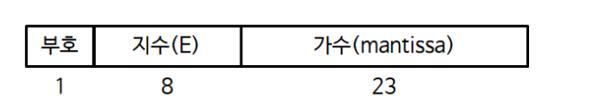

# 중간 시험 정리

# 컴퓨터의 역사

---

## 주판과 파스칼의 계산기

- 인류가 사용하는 계산 도구의 기원은 주판
- 기원전 30세기 정도에 바빌로니아에서 처음 발명
- 중국에서는 1300년경부터 사용되었고, 우리나라에 1400년경에 도입
- 1645년 파스칼은 세계 최초의 기계식 계산기인 파스칼린을 개발
- 파스칼의 계산기는 톱니바퀴의 원리를 이용하여 만들었으며, 덧셈과 뺄셈을 할 수 있는 수동식 계산기이다.

## 베비지의 분석엔진

- 1823년 찰스 배비지는 다항함수를 계산할 수 있는 차분기관을 설계, 발전시켜 1834년 분석엔진을 설계
- 지금의 컴퓨터와 같이 제어장치, 연산 장치, 저장 장치, 입출력장치 등을 포함
- 기계가 수행해야 할 단계들의 순서를 종이 카드에 구멍을 뚫어 지정함으로써 입력장치로 설계
- 분석엔진은 프로그램 언어의 개념은 물론 반복문과 제어문까지 갖추고 있었다.
- 그 당시 기술 수준으로 구현하지는 못했으나 지금의 모든 범용 컴퓨터의 모체가 되는 중요한 의미가 있다.

### 오거스타 에이다

- 영국의 시인 바이런의 딸인 오거스타 에이다, 유명 귀족 집안의 상류층 여성
- 1833년 배비지가 고안한 분석 엔진에 계산과정을 기술하는 프로그램을 만들어 컴퓨터의 시조가 되는데 공헌
- 에이다가 작성한 해석기관에 대한 설명은 컴퓨터 프로그래밍 역사의 기원이 되었다.
- 현대 프로그래밍의 기초가 될 수 있는 개념인 서브루틴, 반복, 점프와 조건 구문을 만들어 냈다.
- 1979년 미국 국방성에서는 그녀의 업적을 기려 새로 개발한 프로그래밍 언어를 “ADA”라고 명명하였다.

## 홀러리스의 천공카드기계

- 1887년 미국의 홀러리스는 전기와 기계가 사용된 최초의 계산기인 천공 카드 기계를 발명
- 1890년 미국의 인구 조사에 사용했다.
- 자료를 카드의 천공 상태로 표현하여 구멍의 유무를 전기적인 신호로 검출하여 사용하는 시스템이다.
- 1980년대까지 이용되던 일괄처리의 효시라고 할 수 있다.
- 1911년 홀러리스가 회사를 설립, 현재의 IBM으로 발전

## 튜링기계와 프로그램 내장방식

- 1936년 영국의 수학자 튜링은 런던 수학 회보에 연구 논문에서 튜링 기계 이론을 발표
- 알고리즘을 수학적이고 기계적인 절차들로 분해하여 동작할 수 있는 컴퓨터의 실행과 저장에 관한 추상적인 모델이다.
- 튜링은 컴퓨터 과학의 계산이론 분야와 알고리즘 분야, 그리고 인공지능 분야 등에서 많은 업적을 남겨
  ‘컴퓨터 과학의 아버지’라 부른다.

<aside>
💡

영화 ‘이미테이션 게임’은 앨런 튜링의 전기를 다룬 영화로서, 2차 세계대전 당시 독일의

에니그마 기계의 암호를 풀기 위한 조직의 팀장으로 참여해 전자 계산기 시스템 봄베를 개발하였다.

튜링팀이 개발한 봄베는 독인의 에니그마 암호 코드를 풀어 연합군이 2차 세계대전을 승리하는

결정적 공헌을 한다.

</aside>

1942년 헝가리인 폰 노이만은 ‘프로그램 내장 방식’ 컴퓨터의 개념을 제시하였다.

- 명령어와 데이터를 이진수로 코드화하여 계산 순서를 미리 기계 내부의 메모리에 저장해 두고 실행할 때
  컴퓨터가 순차적으로 그 기억 내용을 꺼내 해독하여 자동으로 처리하는 방식이다.
- 현재에도 디지털 컴퓨터의 프로그램 방식으로 이용한다.
- 1949년에 영국의 캠브리지 대학에서 폰 노이만의 ‘프로그램 내장 방식’을 최초로 적용한 컴퓨터인
  에드삭이라는 새로운 개념의 컴퓨터가 개발되었다.

## ABC와 마크-1

1942년 미국의 아이오와 주립 대학의 아타나소프 박사는 그의 연구실 조교인 클리포드 베리와 함께

최초의 전자식 컴퓨터인 ABC를 만들었다.

1944년 미국 하버드 대학의 에이킨 사는 협력하여 최초의 전기기계식 자동 계산기인 하버드 마크-1를 개발하였다.

# 컴퓨터의 발전

---

## 진공관을 이용한 제1세대 컴퓨터

1946년 ~ 1956년

- 컴퓨터는 진공관, 저장장치 자기드럼, 입출력 장치 천공카드 이용
- 기계어를 이용하여 프로그램을 만들어 컴퓨터를 작동

### 세계 최초의 전자식 진공관 컴퓨터 에니악

- (미국의 모클리박사와 에커트) 1946년 세계 최초 진공관이 사용된 다용도 전자식 컴퓨터 에니악 탄생
- 십진수를 사용하며, 대포의 탄도 계산을 위해 개발되었다.
- 사람이 하면 20시간이나 걸릴 계산을 단 30초만에 할 수 있었다.

### 프로그램 내장 방식의 에드삭과 에드박

에드삭과 에드박은 폰 노이만이 고안한 프로그램 내장 방식을 적용하였으며 현재의 컴퓨터와 같이

이진법을 채택하였다.

### 세계 최초의 상업용 컴퓨터 유니박

유니박은 미국의 조사 통계국에서 설치, 사용되었다.

## 트랜지스터를 이용한 제2세대 컴퓨터

1956년 ~ 1963년

### 트랜지스터

- 1947년에 개발된 트랜지스터는 진공관을 대체, 1958년부터 컴퓨터에도 접목되기 시작
- 컴퓨터의 크기는 백분의 일로 작아졌고, 성능은 우수하며 가격은 저렴해졌다.
- 주기억장치는 자기 코어를 사용, 보조기억장치에는 자기 디스크를 이용

### 운영체제와 고급 프로그래밍 언어 등장

- 제2세대 컴퓨터 시기에는 하드웨어를 제어하는 운영체제가 처음으로 도입
- 사람의 일상언어와 비슷한 포트란과 코볼이라는 고급 수준의 프로그래밍 언어도 개발
  포트란은 과학기술 분야에 적합하며
  코볼은 사무처리용으로 개발된 프로그래밍 언어다.

## 집적회로를 이용한 제3세대 컴퓨터

1964년 ~ 1970년

제3세대는 집적회로가 사용되었고 메인프레임과 소프트웨어의 체계가 확립된 시기이다.

### 집적회로 개발과 메인프레임의 발전

많은 전자회로 소지를 하나의 기판 위에 모아 놓은 집적회로를 컴퓨터에 사용하자 크기는 더욱 소형화되었다.

또한 가격은 낮추면서 성능을 높일 수 있었다.

### 소프트웨어의 발전

이 시기에는 소프트웨어의 체계가 확립되었으며 운영체제의 다양한 기술이 실현된 시기이다.

- 시분할 시스템 기술이 적용되어 컴퓨터를 대화식으로 사용할 수 있게 되었다.
- 컴퓨터가 동시에 여러 작업을 수행할 수 있는 다중프로그래밍 기술이 적용
- IBM의 메인프레임에서 사용하기 위해 프로그램 언어 PL/1이 개발되었다.
- 미국의 다트머스 대학에서 초심자용 다목적 기호명령부호 언어인 베이직 언어를 개발하여 교육에 활용하였다.

## 고밀도 집적회로를 이용한 제4세대 컴퓨터

1971년 ~ 현재

손톱 크기의 칩에 수억 개의 트랜지스터의 모임

- 1971년 인텔사에서 중앙처리장치인 Intel 4004 마이크로프로세서를 개발
- 1975년 빌 게이츠와 폴 알렌이 알테어 8800에서 사용할 수 있는 프로그래밍 언어 베이직을 개발했고, 판매하기 위해 마이크로소프트 사를 설립
- 1976년 스티브 워즈니악과 스티브 잡스는 애플 사를 창업하여 직접 손으로 제작한 개인용 컴퓨터 키트인 애플 1을 출시

<aside>
💡

빌 게이츠와 스티브 잡스는 모두 1955년 생으로 동시대를 살며 유명한 컴퓨터 회사의 CEO로 성장한 대표적인 콩통점이 있으나 행보에는 차이가 있다.

빌 게이츠

- 부유한 어린 시절을 보내고 하버드 대학을 중퇴
- 개발자라기보다 냉철한 이성으로 결정적 판단을 하는 비즈니스 맨
- 베이직 인터프리터와 DOS를 만들었다.
- 마이크로소프트 사를 만들어 세계적 소프트웨어 회사로 성장시킴

스티브 잡스

- 사생아로 태어나 양부모 밑에서 자랐으며 평범한 리드 대학을 중퇴
- 자기 중심적이고 개성이 강하며 새로운 것에 도전하는 창의성이 강한 개발자
- 컴퓨터 애들을 만들어 개인용 컴퓨터를 대중화 시킴
- 애플을 창업한 이후 넥스트를 창업, 애니메이션 회사인 픽사를 인수 후 1997년 애플의 넥스트 합병으로 다시 애플로 돌아감
- 2011년 췌장암으로 아쉽게 생을 마감

</aside>

## 제5세대 컴퓨터와 양자 컴퓨터

제5세대 컴퓨터란 미래의 컴퓨터를 말한다.

미래의 컴퓨터는 인간과 대화하고 자연 언어로 명령을 처리하며, 인간처럼 생각하고 창의적인 작업도 수행할 수 있을 것이다.

### 양자 컴퓨터

양자 컴퓨터는 현재 슈퍼컴퓨터의 성능을 월등히 앞서는 ‘꿈의 컴퓨터’로 불린다.

양자 컴퓨터란 중첩과 얽힘 등 양자 물리학의 원리를 이용하여 다수의 정보를 동시에 연산할 수 있도록 구현된

새로운 개념의 컴퓨터이다.

- 0아니면 1로만 저장할 수 있는 전통적인 컴퓨터의 bit 대신 0, 1, 그리고 0과 1의 조합을 동시에
  저장할 수 있는 양자 비트인 큐비트를 이용하여 데이터를 처리한다.
- 중첩이 가능해짐에 따라 데이터 처리의 속도가 훨씬 빠르다.
- 양자컴퓨터가 상용화된다면 그 성능은 슈퍼컴퓨터의 성능보다 최소 1억배 이상으로, 슈퍼컴퓨터가 150년
  걸려 계산할 것을 단 4분만에 끝낼 수 있다고 한다.
- 특정 연산에 최적화된 초고속 대용량 컴퓨팅 기술로, 해결하지 못했던 머신러닝, 최적화, 신약 개발,
  암세포 염기서열 분석, 검색 부문의 과제를 해결하는 하나의 수단으로 떠오르고 있다.
- 연산속도는 병렬처리를 통해 ‘큐비트’ 개수당 2의 n승으로 증가한다.

# 컴퓨터의 종류

---

## 1. 슈퍼 컴퓨터

과학기술 계산 전용의 컴퓨터를 의미한다.

- 최근에는 수천 개 이상의 중앙처리장치를 서로 연결하여 대규모의 백터 계산과 행렬 계산을 고속으로 병렬처리하는 슈퍼컴퓨터가 주류를 이루고 있다.
- 슈퍼컴퓨터를 생산하는 대표적 기업으로는 미국 크레이사가 있다.
- 활용 분야로는 기상예보, 지진 및 해일 예보와 같은 지구환경 분야, 천문학 분야, 약학 분야, 의학 및 화학 분야등에서 사용된다.
- 은행 및 보험회사와 같은 금융기관에서도 활용하고 있으며, 영화 제작에도 특수효과를 위해 활용하기도 한다.

## 2. 메인프레임과 미니컴퓨터

### 메인프레임

메인프레임은 다수의 사용자가 함께 쓸 수 있는 대형 컴퓨터

- 주로 대기업이나 은행의 업무처리, 대학교나 연구소 등의 실습실이나 연구실에서 다량의 단말기를 연결해
  사용된다.
- 일반적으로 전산실에 설치되어 있으며, 각 단말기를 통해 입력되는 자료와 작업을 처리한다

### 미니컴퓨터

미니컴퓨터는 성능과 크기 면에서 메인프레임과 워크스테이션 또는 마이크로컴퓨터 사이의 컴퓨터를 말한다.

개인용 컴퓨터의 성능이 빨라져 많이 사라진 상태이다.

## 3. 워크스테이션과 마이크로컴퓨터

### 워크스테이션

워크스테이션은 1980년대에 많이 이용하던 시스템의 용어로 개인이 고도의 수치 처리 능력이 필요한 작업을 수행하는데 편리하고 효율적이며 양질의 그래픽 환경을 제공하여 개인용으로 사용하는 컴퓨터를 말한다. 개인용 컴퓨터의 성능 향상으로 많이 사라진 상태이다.

### 마이크로 컴퓨터

마이크로컴퓨터는 오늘날 사무실이나 가정에 보급되어 있는 개인용 컴퓨터를 말한다. 크게 인텔 CPU가 탑제된

개인용 컴퓨터와 애플 사의 맥 컴퓨터로 분류할 수 있다.

## 4. 휴대형 컴퓨터

디지털 보조기, 노트북, 스마트폰, 태블릿 PC

### 컴퓨터의 정의

🔹 전자적으로 계산을 수행하는 장치

🔹 처리, 저장, 입력, 출력

🔹 입력을 받아들여 → 내부 전자회로에서 자료를 계산하거나 처리 → 정보를 저장 → 결과를 출력

### 컴퓨터와 컴퓨터 시스템

**컴퓨터**

🔹 하드웨어와 소프트웨어가 결합된 기계

🔹 범위가 좁음

🔹 데스크탑, 노트북

**컴퓨터 시스템**

🔹 컴퓨터 뿐만 아니라 네트워크, 사용자, 데이터 등이 포함된 환경

🔹 범위가 넓음

🔹 은행의 전산시스템, 기업의 it시스템, 인터넷 서비스 제공 시스템

### 하드웨어

🔹 데이터의 입력, 처리, 출력을 제어하는 데 사용되는 물리적인 기계 장치

🔹 5가지 구성요소 - 중앙처리장치, 주기억장치, 보조기억장치, 입력장치, 출력장치

### 소프트웨어

🔹 컴퓨터가 수행할 작업을 지시하는 전자적 명령어들의 집합(프로그램)

🔹 시스템 소프트웨어(운영체제, 유틸리티)와 응용소프트웨어(프로그램 개발도구, excel, ppt, 등)

🔹 주로 파일을 처리함

### CPU(중앙처리장치 Central Processing Unit)

🔹 마이크로프로세서, 프로세서라고도 부름

🔹 제어장치, 연산장치, 레지스터, 버스로 구성

**연산장치** : 누산, 자료 레지스터에 저장된 자료 → 결과는 다시 누산 레지스터에 저장 →

            필요시 주기억장치에 저장되거나 다른 연산에 사용

**제어장치** : 인간의 뇌와 같은 요소, 여러 개의 해독기와 제어기로 구성

### GPU(그래픽 처리 장치)

🔹 1999년 엔비디아 사, GPU라 지칭

🔹 고속의 병렬처리 → 대량의 행렬과 벡터를 다루는데 뛰어난 성능 발휘

🔹 실수와 벡터 연산에서 CPU보다 약 10배 이상 빠름

🔹 GPU활용

디스플레이가 화려한 게임

이미지 처리 및 분석

비트코인 채굴

대량의 행렬과 벡터 연산(빅데이터, 인공지능)

### 모바일 AP

🔹 모바일 기기의 두뇌 역할을 담당하는 반도체 칩

🔹 CPU의 주된 기능 외에 여러가지 시스템 장치와 인터페이스 제어 기능

🔹 여러 기능의 반도체를 한 개의 칩에 모아 만든 시스템온칩

🔹 대표적인 AP : 퀄컴, 삼성, 엔디비아, 애플

### 단위 표현

🔹 **비트 == 0또는 1인 값**

컴퓨터의 정보 처리 단위중에서 가장 작은 정보 단위

🔹 **니블 == 4bit**

🔹 **바이트 == 8bit**

🔹 **워드 == 32bit**

### 저장 용량

| B   | 바이트 | 0승  |
| --- | ------ | ---- |
| KB  | 킬로   | 10승 |
| MB  | 메가   | 20승 |
| GB  | 기가   | 30승 |
| TB  | 테라   | 40승 |
| PB  | 페타   | 50승 |
| EB  | 엑사   | 60승 |
| ZB  | 제타   | 70승 |
| YB  | 요타   | 80승 |

### 진수

🔹 **2진수** : 0, 1

🔹 **8진수** : 0~7까지의 8가지의 수

🔹 **16진수** : 0~9, A~F

🔹 **10진수 소수 → 2진수 변환**

1.625 = 1.101

소수부에 2를 곱하는데 그 결과가  1로 떨어질 때까지 혹은 똑같은 소수점이 나올 때까지 반복한다.

0.625 x 2 = 1.250 (정수부는 버리고 0)

0.250 x 2 = 0.500

0.500 x 2 = 1.000

앞에만 나열 101

🔹 **2, 8, 16진수간 상호관계**

8진수는 3자리씩, 16진수는 4자리씩

### 부동소수

🔹 **단정도 형식**



**부호** : 양수는 0, 음수는 1

**지수** : 127 초과 이진수

정규화 하고 남는 승을 127에서 뺀 나머지를 8bit로 표현

**가수** : 부동소수의 가수를 왼쪽부터 저장, 남는 나머지는 모두 0으로

ex) 10진수 0.15625를 2진수로 변환하면 0.00101이며 이것을 정규화 하면 1.01 \* 2^-3

부호 : 양수이므로 0

지수 : -3이므로 127+(-3) = 124 ⇒ 01111100

가수 : 01이후 나머리 21개 비트는 모두 0

### 정규화

소수점을 이동시켜 정수부가 한자리가 되도록 변환

```
1110110.101 → 1.110110101 x 2^6
```

소수점 기준 왼쪽으로 이동시 승, 오른쪽으로 이동시 - 승이된다.

### 1의 보수, 2의 보수

1의 보수 : 0은 1로 1은 0으로

2의 보수 : 1의 보수 + 1

🔹 컴퓨터는 음수를 인식하지 못하기 때문에 계산시 음수를 1의보수나 2의보수를 변환해 계산

❌ 1의 보수 오버플로는 +1

❌ 2의 보수 오버플로는 버림

❌ 답이 양수 일때는 마무리 변환 안해도됨, 음수일 때 마무리 보수 변환해줘야됨

### 논리게이트 기호


### 명령어 형식

🔹 연산 부분과 피연산

🔹 **연산** : 명령어가 수행해야 할 기능을 의미

🔹 **피연산** : 참여하는 자료(주소)를 의미

🔹 16비트 명령어

4비트는 연산 종류 / 12비트는 피연산자의 메모리 주소

피연산자 수는 없거나 2개 또는 3개(메모리 주소 또는 레지스터)

### 저급언어

🔹 **기계어** : 0과 1로 나타낸 컴퓨터 고유 명령 형식 언어

🔹 **어셈블리어** : 자연 언어와 유사하게 만든 언어

### 버스

**CPU와 메모리 또는 입출력 장치 간의 정보 전달을 위한 통로**

🔹 **주소버스**(단방향)

CPU가 어디(메모리 주소)에 접근할 지 지정

🔹 **자료버스**(양방향)

실제 데이터 값을 전달

🔹 **제어버스**(양방향)

동작 제어 신호를 주고받음(읽기/쓰기/인터럽트 등)

### 캐쉬 메모리

🔹**주기억장치와 CPU의 속도의 차이를 해결하기 위한 메모리**

🔹 메인 메모리보다 약 10배쯤 빠름

(저장 속도가 빠르고 고가인 SRAM을 이용)

🔹 캐쉬의 종류 : 수준1캐쉬, 수준2캐쉬, 디스크 캐쉬

### 버퍼

🔹 속도 차이가 나는 두 장치 간에 효율적인 작업 처리를 위한 **임시저장공간**

🔹 RAM의 일부를 임시저장 공간인 버퍼 메모리로 사용

### 레지스터

🔹 중앙처리장치 내부처리 연산에 필요한 다양한 **임시 기억장소**

| DR  | 자료 레지스터   | 연산에 필요한 피연산자를 저장              |
| --- | --------------- | ------------------------------------------ |
| AR  | 주소 레지스터   | 현재 접근할 기억장소의 주소를 기억         |
| AC  | 누산 레지스터   | 연산장치의 입출력 데이터를 임시적으로 기억 |
| IR  | 명령어 레지스터 | 현재 수행중인 명령어를 저장                |
| PC  | 프로그램 카운터 | 다음에 실행할 명령어의 메모리 주소가 저장  |
| TR  | 임시 레지스터   | 임시로 자료를 저장(==범용 레지스터)        |

### RAM

🔹 소멸성, 정보의 읽기와 쓰기가 가능

🔹 **DRAM** : 일정한 주기마다 재충전 필요 ⇒ 주기억장치로 주로 사용

🔹 **SRAM** : 전원만 연결되어 있으면 정보가 지워지지 않음 ⇒ 캐쉬 메모리에 주로 사용

🔹 **VRAM** : GPU에 주로 사용

### ROM

🔹 비소멸성, 읽기만 가능, 임의 접근 메모리

🔹 Mast ROM, PROM, EPROM

### BIOS

🔹 컴퓨터를 시작한 후 운영체제가 시스템을 제어하기 전까지 하드웨어를 점검

🔹 컴퓨터의 부팅을 위한 펌웨어

🔹 컴퓨터의 전원 연결 → 바이오스가 POST 실행

### 보조기억장치

🔹 CPU 외부에 위치, 순차 접근(자기 테이프), 직접 접근(자기 디스트와 자기 드럼)

🔹 HDD : 헤드를 이용 여러 개의 원형 알루미늄 기판인 디스크에 자료를 저장

🔹 SSD : 플래시메모리와 컨트롤러로 구성

HDD보다 읽고 쓰는 속도가 빠르며 전력 사용량 적고, 충격에 강함, 발열과 소음 적음

🔹 플래시 메모리 : RAM과 ROM의 장점을 합친 메모리

소비전력이 적고, 비소멸성 메모리

### 저장장치의 계층

레지스터(CPU내부) > 캐시메모리(SRAM) > 주기억장치(DRAM) > 보조기억장치(SSD, HDD)

### 기계주기

🔹 명령어의 집합인 중앙처리장치는 하나의 명령을 실행하기 위해 인출, 해독, 실행의 세과정을 거침

### 마이크로프로세서 성능

🔹 자료버스 폭

🔹 클럭 속도

🔹 병렬 처리(한 번에 여러 개의 명령어를 동시에 실행)

🔹 컴퓨터의 성능(CPU의 성능과 RAM의 용량)

### CISC와 RISC

|                 | CISC                                 | RISC                             |
| --------------- | ------------------------------------ | -------------------------------- |
| 명령어 수       | 많고 복잡                            | 단순하고 적음                    |
| 명령어 길이     | 가변 길이                            | 고정 길이                        |
| 실행 속도       | 한 명령어에 많은 작업 → 느릴 수 있음 | 빠름                             |
| 하드웨어 복잡도 | 복잡                                 | 간단                             |
| 대표 CPU        | 인텔 x86, AMD 등                     | ARM, MIPS, RISC-V 등             |
| 메모리 접근     | 명령어 내에서 직접 접근 가능         | 명령어는 레지스터 간 연산만 수행 |
| 사용            | 일반 PC, 노트북                      | 모바일, 저전력 디바이스(ARM 계열 |

### 운영체제

🔹 컴퓨터 시스템의 전반적인 동작을 제어하고 조정하는 시스템 프로그램

🔹 하드웨어와 응용프로그램 간의 인터페이스 역할

🔹 CPU, 주기억장치, 입출력장치, 파일 시스템 등의 컴퓨터 자원을 관리

🔹 사용자와 컴퓨터 시스템 사이의 인터페이스 담당

컴퓨터의 동작 구동, 입출력 연산제어, 프로그램 실행 제어, 데이터와 파일의 저장 관리

### 운영체제 목적, 기능

🔹 컴퓨터 시스템의 자원을 편리하게 사용할 수 있는 환경을 제공

🔹 컴퓨터 시스템 자원들을 효율적으로 관리하여 성능을 최적화

🔹 컴퓨터의 기능을 사용자가 잘 활용하도록 돕고, 하드웨어가 성능을 잘 발휘하도록 관리

### 운영체제 운용기법

1세대 : 일괄 처리

2세대 : 다중 프로그래밍, 시분할, 실시간 처리

3세대 : 다중모드

4세대 : 분산 처리

### 사용자 인터페이스

**명령행 CLI** : 운영체제가 제공하는 기능을 키보드 입력을 통해 사용하는 인터페이스

MS도스, 유닉스의 여러 쉘, 윈도우즈의 명령 프롬프트

**그래픽 CUI** : 애플의 맥, 유닉스의 x윈도우, MS윈도우

### 프로세스

🔹 메모리에 적재되어 실행 중이거나 대기 중인 프로그램

**기능** : 생성과 삭제, 중지와 계속, 동기화

**상태** : 준비, 대기, 실행

🔹 프로세서 : 중앙처리장치(CPU)를 의미

🔹 프로그램 : 특정 작업을 수행하는 일련의 명령어들의 집합

### 인터럽트

🔹 프로그램 실행 도중 예기치 않은 상황이 발생할 경우 현재 실행중인 작업을 중단하고

발생된 상황을 처리한 후 다시 실행중인 작업으로 복귀하는 것

종류 : 외부, 내부, 소프트웨어 인터럽트
